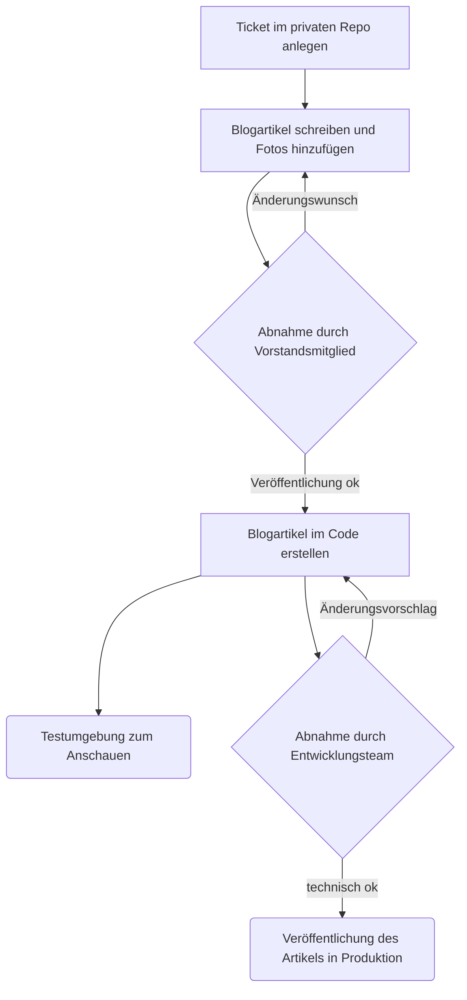

# Website der Feuerwehr Kronshagen

Die Freiwillige Feuerwehr der Gemeinde Kronshagen (bei Kiel) spielt eine zentrale Rolle im Schutz und der Sicherheit der
Gemeinschaft. Als ehrenamtliche Organisation ist es unser Ziel, stets einsatzbereit zu sein, um bei Notfällen schnell
und effizient reagieren zu können. Wir sind nicht nur Helfer in der Not, sondern auch ein fester Bestandteil des
gesellschaftlichen Lebens in Kronshagen. Besonders stolz sind wir auf unsere Jugendfeuerwehr, die jungen Menschen die
Möglichkeit bietet, frühzeitig Verantwortung zu übernehmen. Durch regelmäßige Übungen und spannende Aktivitäten fördern
wir Teamgeist und Engagement und bereiten die nächste Generation auf ihre zukünftigen Aufgaben vor.

## Erste Schritte (für alle Kameradinnen und Kameraden)

**Wichtig:** Alles, was hier auf Github steht, ist öffentlich einsehbar!

Alle Informationen, die hier eingetragen werden, sind öffentlich sichtbar und können nicht wieder versteckt werden.

- Für interne Gespräche nutzt bitte die bekannten Kanäle.
- [Hier sind die wichtigsten Begriffe erklärt](./docs/erste-schritte/Grundbegriffe.md)
- Es gibt ein [besonderes Verzeichnis (Repository)](https://github.com/Feuerwehr-Kronshagen/private), auf das nur
  Mitglieder der [Organisation](https://github.com/Feuerwehr-Kronshagen) Zugriff haben.

### Aufgaben und Planung

Es gibt ein [Projekt](https://github.com/orgs/Feuerwehr-Kronshagen/projects/1), in dem alle Aufgaben
aufgelistet sind.

Die Aufgaben (Tickets) können entweder

- öffentlich sichtbar sein: [Homepage-Verzeichnis](https://github.com/Feuerwehr-Kronshagen/homepage),
- oder nur für Mitglieder zugänglich sein: [privates Verzeichnis](https://github.com/Feuerwehr-Kronshagen/private).

Die Aufgaben sind in Phasen eingeteilt, die anzeigen, wann sie erledigt werden sollen. Die Zahlen (1️⃣, 2️⃣, ...) zeigen
an, wie wichtig eine Phase ist. Phasen mit der gleichen Zahl können gleichzeitig bearbeitet werden.

Die Aufgaben sind außerdem nach Themen sortiert (Kategorien). Wenn eine neue Aufgabe erstellt wird, schaut man von
oben nach unten, zu welchem Thema sie passt. Wenn kein Thema passt, wird die Aufgabe der Kategorie „DevBizOps“
zugeordnet. Das umfasst alles rund um Entwicklung, Geschäftsprozesse, Organisation und Betrieb.

## Blogartikel

<details>
  <summary>Prozess-Diagram anzeigen</summary>



</details>

### Tickets im privaten Repo anlegen

Lege über [diesen Link](https://github.com/Feuerwehr-Kronshagen/private/issues/new?template=blog.md) ein Ticket
im [privaten Verzeichnis](https://github.com/Feuerwehr-Kronshagen/private) an.

### Blogartikel schreiben und Fotos hinzufügen

Schreibe den Blogartikel oder die Idee auf. Du kannst nur die Idee notieren oder den
Blogartikel direkt ausformulieren. Möchtest du ihn ausformulieren, kannst du Zwischenstände speichern und später
erneut bearbeiten. Das beugt Datenverlust vor, falls Du den Browser schließen solltest.

Hast du das Ticket gespeichert und möchtest den Artikel bearbeiten, kannst du auf die 3 waagerechten Punkte oberhalb
rechts des Textfeldes klicken und `Edit` auswählen.

Unter dem Textfeld (im Bearbeitungsmodus) gibt es eine Büroklammer mit `Paste, drop or click to add files`. Hier
kannst du Bilder hinzufügen.

Jeder Blogartikel sollte mindestens ein Bild haben. Bitte hinterlasse bei mehreren Bildern eine Information, welches
Bild als Titelbild erscheinen soll.

Ist der Blogartikel fertig, kannst du in den Kommentaren @Feuerwehr-Kronshagen/vorstand markieren und fragen, ob der
Artikel so OK ist.

### Abnahme durch Vorstandsmitglied

Die [Vorstandsmitglieder](https://github.com/orgs/Feuerwehr-Kronshagen/teams/vorstand) sind inhaltlich und rechtlich
für die Website verantwortlich und geben konstruktives Feedback zum Artikel, bevor er den privaten Bereich verlässt.

Gibt es keine Änderungswünsche oder wurden diese umgesetzt, kann der Artikel veröffentlicht werden.

### Blogartikel im Code erstellen

<details>
  <summary>Branch anlegen für Non-Techies</summary>

Öffne das Ticket zum Blogartikel und klicke rechts auf "Development".

Über den Pfeil, der nach links zeigt, kannst du das Repository auf `Feuerwehr-Kronshagen/homepage` ändern.

Klicke nun auf "create branch" und wähle den Namen des Branches und erstelle ihn mit lokalem checkout. Schließe
das Fenster wieder.

Klicke auf den eben erstellten Branch-Namen rechts unter "Development". Du solltest das Repo "homepage sehen"

Nun kannst du mit der Punkt-Taste `.` in den Web-Editor wechseln. Dieser benötigt ein bisschen Zeit zum Laden.

</details>

In [content/posts](https://github.com/Feuerwehr-Kronshagen/homepage/tree/main/content/posts) liegen alle
Blogartikel der Website.

Lege einen neuen Ordner an. Der Ordnername setzt sich wie folgt zusammen: `<ID>-<Name-des-Blogartikels>`

- Dreistellige ID (fortlaufende Nummer) für den Artikel, führende Nullen
- Name des Blogartikels mit '-' statt Leerzeichen

Hinterlege die ID im Titel vom Ticket, damit Andere auf einen Blick einsehen können welche IDs schon vergeben sind.

Mit jedem Push wird ein Deployment in der Testumgebung https://test.feuerwehr-kronshagen.de erzeugt. Hier kannst du
deinen Branch-Namen auswählen und dir deine Änderungen ansehen.

### Abnahme durch Entwicklungsteam

Bist du mit deinen Änderungen zufrieden, kannst du einen Pull-Request stellen. Das
[Entwicklungsteam](https://github.com/orgs/Feuerwehr-Kronshagen/teams/dev) wird automatisch benachrichtigt und
schaut sich deine Änderungen an. Du erhältst ein konstruktives Feedback.

Sobald deine Änderungen technisch OK sind, gibt es eine Bestätigung und deine Änderungen können "zusammengeführt"
werden. Nach dem Zusammenführen (Merge) werden deine Änderungen auf die Produktion veröffentlicht.

## ADR - Architecture Decision Records - Logbuch für Architektur-Entscheidungen

> Der Einsatz von ADR ist eine Methode, Entscheidungen im Entwicklungsprozess nachvollziehbar und kontinuierlich zu
> dokumentieren.
> [Quelle und weitere Informationen](https://www.heise.de/hintergrund/Gut-dokumentiert-Architecture-Decision-Records-4664988.html?seite=all)

Das Verzeichnis `/docs/adr` enthält Architekturentscheidungen für dieses Projekt in Form von **Architecture Decision
Records (ADRs)**.

[Erster ADR](./docs/adr/0001_Architektur-Entscheidungen_dokumentieren.md)

### Warum ADRs?

In einem Software-Projekt ist es wichtig, dass Architekturentscheidungen nachvollziehbar und dokumentiert sind – nicht
nur im Code oder in den Köpfen. ADRs helfen uns:

- wichtige Entscheidungen zu dokumentieren,
- zukünftigen Teammitgliedern Kontext und Einstiegshilfen zu bieten

### Format

Es wird ein schlankes Markdown-Format ohne Status-Feld verwendet. Der Git-Workflow bildet den Lebenszyklus einer
Entscheidung ab:

- **Vorschlag** →
  - Erstelle einen Merge-Request mit dem neuen ADR.
  - Jeder ADR erhält einen Dateinamen nach folgendem Muster: `NNNN_Titel_der_Architektur-Entscheidung.md`
- **Diskussion** → Review und Feedback im MR
- **Annahme** → Merge in `main` (oder Hauptbranch) = Entscheidung angenommen
- **Ersetzt** →
  - Erstelle einen Merge-Request mit dem neuen ADR, der den alten ADR ersetzt
  - Markiere den alten ADR mit einem `x` nach der ADR-Nummer: `NNNNx_Titel_der_Architektur-Entscheidung.md`
  - Verlinke den alten ADR im neuen ADR unter dem Titel: `Ersetzt [0001](NNNNx_Titel_der_alten_Entscheidung.md)`

### Bestehende ADRs ändern?

Grundsätzlich sollte eine Änderung vermieden werden. Klarstellungen nach Rückfragen sind ok. Wenn sich eine Entscheidung
ändert, wird ein neuer ADR geschrieben, der den alten ADR referenziert. Der alte ADR wird im Dateinamen mit einem `x`
nach der ADR-Nummer versehen.

## Design

[Designvorgabe (design brief)](docs/design/design_brief.md)

[Wireframes (erste Skizzen)](docs/design/wireframes.md)

## Deployment

Die Website wird über GitHub-Actions gebaut und mit Ansible auf einem vServer deployed.

⚠️Bekannter Fehler: Werden die Ansible-Dateien auf der Testumgebung verändert und die GitHub-Action ausgeführt, würde
derselbe Server angepasst, auf dem auch die Produktion läuft. Deshalb wird das Deployment verhindert. Ein Test des
neuen Deployments ist über einen lokalen Server möglich.

### Zertifikate

Damit die Website mit HTTPS und ohne Sicherheitswarnungen aufgerufen werden kann, müssen SSL-Zertifikate auf dem
Server hinterlegt sein. Dies geschieht automatisch durch den [Certbot](https://certbot.eff.org/) mit
[Letsencrypt](https://letsencrypt.org/de/).

Um das Neugenerieren von Zertifikaten anzustoßen, gibt es eine GitHub-Action.

1. Öffne den
   [Certificates-Workflow](https://github.com/Feuerwehr-Kronshagen/homepage/actions/workflows/certificates.yml)
2. Klicke oben rechts auf den Button "Run workflow" (wenn sichtbar).
   Falls du ihn nicht siehst, prüfe, ob du im richtigen Branch bist (z.B. main) und über die nötigen Berechtigungen
   verfügst.
3. Wähle (falls vorhanden) den Branch aus, gegen den die Action ausgeführt werden soll (normalerweise main).
4. Klicke anschließend auf "Run workflow".
5. Die Action wird gestartet und durchläuft mehrere Schritte.
6. Es kann einige Minuten dauern, bis das neue Deployment unter den Deployments sichtbar wird.
7. Das neue Deployment hat denselben Commit wie das vorherige, aber den Status "active".

### Rollback

Ein Rollback sollte nur im Notfall ausgeführt werden. Lies diese Anleitung zuerst einmal komplett durch.

1. Öffne [die Prod-Deployments](https://github.com/Feuerwehr-Kronshagen/homepage/deployments/production)
2. Wähle einen Stand aus, auf den ein Rollback stattfinden soll. Graue Haken zeigen an, dass das Deployment in der
   Vergangenheit erfolgreich war. So ein Deployment sollte gewählt werden. Das aktuelle Deployment wird mit "active"
   gekennzeichnet.
3. Klicke die 3 Punkte am Ende der Zeile des ausgesuchten Stands
4. Klicke "View Workflow run"
5. Eine neue Seite öffnet sich
6. Klicke den Button "Re-run all Jobs" oben auf der Seite
7. Im Modal "Enable debug logging" nicht anhaken und "Re-run jobs" klicken
8. Zuerst wird die Anwendung gebaut. Deshalb taucht das neue Deployment nicht sofort auf. Nach einer Weile erscheint
   ein neues Deployment mit "active". Die Commit-Message des neuen Deployments ist identisch zum gewählten
   ehemaligen Deployment.

## Entwicklung

```bash
make 01-dev-server
```
