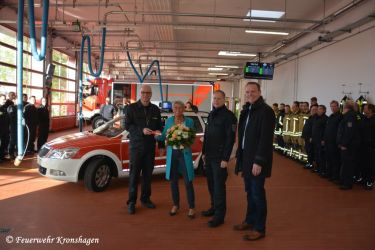

Am Montag den 07.05.2019 war es nun endlich soweit und den Kameraden der Feuerwehr Kronshagen wurden durch den Bürgermeister Herrn Ingo Sander die Schlüssel zum „neuen gebrauchten“ KdoW (Kommandowagen) übergeben.
Zuvor wurde der edlen Spenderin Frau Rinio durch den Bürgermeister und dem Wehrführer Christian Esselbach gedankt, denn hatte sich doch Frau Rinio mit 10000 Euro an dem 19850 Euro teuren Gebrauchtwagen auf Skoda Octavia 4x4 Fahrgestell beteiligt.

Rinio: Ich habe mit dem Wehrführer auf der Jahreshauptversammlung gesprochen und gefragt, wo der Schuh denn drückt und was denn noch fehlen würde. Es fehlt ein Fahrzeug für Lehrgänge und kleine Unterstützungsfahrten, da der MTW oftmals schon zu Lehrgängen unterwegs ist und manch ein Kamerad mit dem Privatwagen fahren muss und das finde ich nicht gut, so Rinio weiter. Also war ich gerne bereit, für dieses wichtige Ehrenamt ein wenig beizusteuern.
Das es nun diese Lösung geworden ist, lag daran, dass bei einem Feuerwehrbedarf- Zulieferer ein Fahrzeug stand, das beklebt und als KdoW ausgestattet auf dem Hof stand. Es wurden mit der Gemeinde und den Fachausschüssen mehrere Gespräche geführt und man schaffte es schlussendlich dieses Fahrzeug zu beschaffen. Dadurch können besser und wirtschaftlicher die ca. 100 Lehrgangstage im Jahr bewältigt werden.
Von uns allen nochmals DANKE Familie Rinio für dieses großartige Zeichen fürs Ehrenamt.
Der Bürgermeister und Familie Rinio hatten gerade die Feuerwache an der Nußbaumkoppel verlassen, da meldete sich der Funkmelder mit FEU BMA Y (Feuer Brandmeldeanlage ausgelöst Menschenleben in Gefahr).  
Da ja bereits 30 Kameraden wegen dem Übungsdienst und der Übergabe des Fahrzeugs in der Wachen waren, konnte man im Zug ausrücken in Richtung Betreuungseinrichtung am Amalienweg.
Der Einsatzleiter wurde bereits vom Pflegepersonal empfangen und gleich in Richtung Heizungsraum geleitet.  
Dort angekommen, konnte man einen Brandgeruch feststellen. Schnell war klar, dass der untere Bereich evakuiert werden musste, da sich in diesem Bereich Zimmer von teils bettlägerigen Heimbewohnern befanden. Diese wurden durch die Feuerwehr und das Pflegepersonal in Sicherheit gebracht.
Danach konnte der Angriffstrupp mit dem 1. Rohr Zugang zum Heizungskeller verschaffen. Auch angrenzende Räume wurden mit Wärmebildkamera abkontrolliert, ohne Feststellung. Die Einsatzleitung entschied sich dazu die Anlage Notaus zu betätigen. Trotz intensiver Suche konnten die Einsatzkräfte nichts weiter feststellen. Man untersagte den Betrieb der Anlage bis zum Eintreffen der Wartungsfirma und übergab die Einsatzstelle an die Polizei, die so lange vor Ort blieb bis die entsprechende Firma vor Ort war.
Zu erwähnen ist, dass bei diesem Einsatz auch gleich der neue KdoW eingesetzt werden musste, denn alle Fahrzeuge waren ausgerückt und man benötigte Sondergerät an der Einsatzstelle.
Christian Esselbach  
Ihre und eure Feuerwehr Kronshagen
