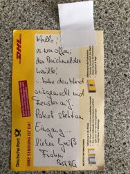

"Die Braut, die sich was traut" hatten wir ja schon.   
Das nächste Kapitel der besonderen Einsätze würde dann wohl heißen: Wenn der Postmann zweimal klingelt.
Heute um 14:30 Uhr wurden wir in eine Kindertagesstätte gerufen, da dort Rauch festgestellt wurde.  
Bei unserem Eintreffen fanden wir jedoch nur diesen Zettel vor, ausgestellt von der Deutschen Post.  

Was war passiert?  
Ein abgedeckter aber dennoch eingeschalteter Herd begann langsam Hitze und damit Rauch zu entwickeln, woraufhin der Rauchmelder anschlug. Nachdem der Notruf abgesetzt wurde, begaben sich alle Personen auf dem Sammelplatz **h i n t e r** dem Haus. Währenddessen ging der Paketbote **v o r n e** ins Haus, fand aber niemanden vor außer diesen furchtbar lärmenden Rauchmelder. Er erkannte die Situation schnell, schaltete den Herd aus, nahm den Rauchmelder von der Decke und öffnete sogar noch ein Fenster zur Belüftung!
Weil time aber bekanntlich money ist, ließ er das Paket mit der Notiz an der Tür stehen und setzte seine Tour fort, noch bevor die Feuerwehr oder gar die Polizei eingetroffen sind !

Hut ab für diese Leistung.
Wir wünschen euch ein schönes Wochenende  
Ihre und eure Feuerwehr Kronshagen
