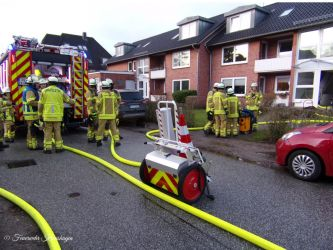

Am 18.01.2020 wurden wir um 15:20 Uhr in den Hufenkamp alarmiert. Dort hatten Anwohner den Alarmton eines Rauchwarnmelders sowie eine Rauchentwicklung wahrgenommen.
Die erste Lageerkundung ergab, dass es in einer Wohnung brannte. Eine Person konnte bereits vor Eintreffen der Feuerwehr von Nachbarn aus der Wohnung gerettet werden. Sie wurde dem Rettungsdienst zur weiteren Behandlung übergeben.

Der Angriffstrupp setzte zunächst den Rauchvorhang. Dieser wird in die Türzarge geklemmt, um beim Öffnen der Tür zur Brandwohnung die Rauchausbreitung in den Treppenraum zu verhindern. Anschließend konnte das Feuer zügig mit einem C-Rohr gelöscht werden. Zeitgleich wurde die Überdruckbelüftung eingeleitet. Eine durch das Feuer geborstene Wasserleitung wurde durch den Angriffstrupp abgeschiebert. Anschließend wurde die Einsatzstelle aufgeklart. Um eine Kontaminationsverschleppung zu vermeiden und die Gesundheit der Kameraden zu schützen, tauschte der Angriffstrupp noch an der Einsatzstelle die Einsatzbekleidung gegen einen Trainingsanzug. Einsatzende für uns nach knapp 2 Stunden.
Ihre und eure Feuerwehr Kronshagen  
Zuverlässig. Professionell. Vor Ort.
