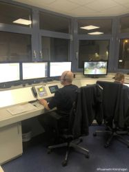

Am gestrigen Sonntag hat sich der Sturm Sabine im gesamten Bundesgebiet ausgetobt.
Die Feuerwehr Kronshagen ist mit zwei Einsätzen in der Gemeinde noch glimpflich davon gekommen. Allerdings wurde um 17:09 Uhr erstmalig die Abschnittsführungsstelle Kronshagen alarmiert. Diese wird bei sogenannten Flächenlagen alarmiert, um die Leitstelle zu entlasten und die Kommunikation zu den Einsatzkräften sicherzustellen. Einsätze die bei der Leitstelle auflaufen werden dann per Fax an die Feuerwehr Kronshagen geschickt. Hierbei werden nicht nur die Einsätze in Kronshagen koordiniert, sondern auch die Einsätze für das Amt Achterwehr.
Somit sind wir für insgesamt 11 Feuerwehren zuständig. Zusätzlich zu dem besonders geschulten Betriebspersonal für die Abschnittsführungsstelle aus Kronshagen sammeln sich die Führungskräfte aus dem Amt Achterwehr im Lage/Stabsraum der Kronshagener Wehr, um  
jederzeit eine Beurteilung der Lage durchführen zu können. Des Weiteren liegt die Entscheidung welche Ressourcen zu welchem Einsatz fahren weiterhin bei den Verantwortlichen des Amtes. 
  
Aus unserer Sicht hat der Betrieb der Afüst, sowie die Zusammenarbeit mit den Führungskräften aus dem Amt Achterwehr reibungslos funktioniert. Vielen Dank dafür!

Ihre und eure Feuerwehr Kronshagen  
Zuverlässig. Professionell. Vor Ort.
