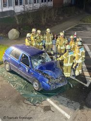
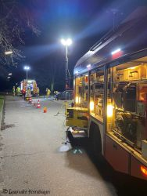

Im Sachgebiet Einsatz / Ausbildung wurde im letzten Jahr ein neuer Trainingsplan für die Feuerwehr Kronshagen erarbeitet. Jede unserer Einsatzgruppen durchlaufen jetzt die gleichen Themen in einem speziellen Rhythmus.
Die Trainingsblöcke unterteilen sich in Brandbekämpfung, Gefahrgut (CBRN) und Technische Hilfeleistung. Hinzu kommen Sonderblöcke die für unsere Spezialgruppen wie z.B. die Führungsgehilfen für den Einsatzleitwagen und die FEZ oder die Absturzsicherer genutzt werden. Kameraden die keiner Spezialgruppe angehören, haben die Möglichkeit an verschiedenen angebotenen Kurzthemen teilzunehmen. Weiterhin findet zusätzlich im 3 wöchigem Rhythmus das Atemschutztraining statt. Um im Themenblock Technische Hilfeleistung effizienter das Retten von Personen aus verunfallten PKWs trainieren zu können, stehen zukünftig bis zu 8 „Schrottautos“ im Jahr zur Verfügung. Wir hoffen, dass sich der neue Trainingsplan gut etabliert und werden am Jahresende ein entsprechendes Fazit ziehen.

Ihre und eure Feuerwehr Kronshagen  
Zuverlässig. Professionell. Vor Ort.
