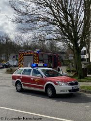

Gestern haben wir euch berichtet, dass wir einen Einsatzleiter vom Dienst (EvD) eingeführt haben. Sönke Körner unser stv. Wehrführer hat die erste 7-tägige Einsatzbereitschaft übernommen und den Kommandowagen als Dienstfahrzeug bei sich. Bei einem Einsatz kann der EvD dann sofort die Einsatzstelle anfahren um zeitorientiert geeignete Maßnahmen anzuordnen. Heute kam es dann zum ersten Einsatz wie Sönke berichtet:
Am heutigen Donnerstag um 10:48 Uhr hatte der Hausmeister eines Hochhauses in Kronshagen den Alarm eines Rauchwarnmelders in einer Wohnung wahrgenommen und die Feuerwehr alarmiert.
Die Feuerwehr musste sich für den Einsatz des Angriffstrupps unter Atemschutz gewaltsam Zugang zur Wohnung verschaffen. Parallel wurde durch den Einsatzleiter weitere Kronshagener Kräfte in den Einsatz gebracht.

Die Ursache der stark verrauchten Wohnung war ein eingeschalteter Küchenherd, auf dem angebranntes Essen stand.
Der Bewohner war nicht zugegen.
Die Wohnung wurde mittels Belüftungsgerät rauchfrei gemacht.
Ihre und eure Feuerwehr Kronshagen.  
Zuverlässig. Professionell. Vor Ort.
