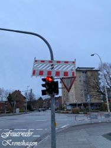
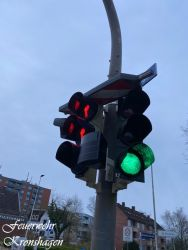
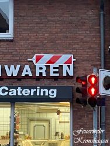
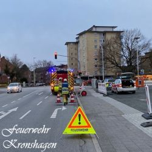
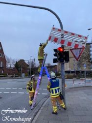

Heute um 06:12 Uhr wurden wir von der IRLS Mitte mit dem Einsatzstichwort TH-K alarmiert.
Im Kreuzungsbereich Kopperpahler Allee/Kieler Straße hatten unbekannte Absperrschrankenteile auf zwei Ampelanlagen und über ein Firmenschild befördert.
Die Absperrschrankenteile wurden, nach vorherigen Verkehrssicherungsmaßnahmen, von der Feuerwehr abgenommen und gesichert.
 |  |   
---|---|---  
 |  |   
Ihre und eure Feuerwehr Kronshagen  
Zuverlässig. Professionell. Vor Ort.
