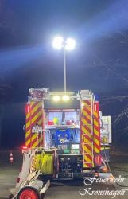

Am heutigen Montag um 00:55 Uhr wurden wir mit dem Einsatzstichwort FEU-K BMA in eine Flüchtlingsunterkunft alarmiert.
Ausgelöst hatte ein Rauchwarnmelder im Obergeschoss. Dieser Bereich und folgend angrenzende Bereiche wurde durch den Angriffstrupp ab kontrolliert. Es konnte keine Schadenereignis festgestellt werden.   
  
Die Brandmeldeanlage wurde zurückgestellt und die Einsatzstelle der Polizei übergeben.  
  
Ursache der Auslösung des Rauchwarnmelders war unsachgemäßes Verhalten im Objekt.

Ihre und eure Feuerwehr Kronshagen  
Zuverlässig. Professionell. Vor Ort.
