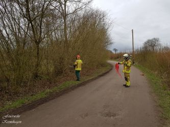
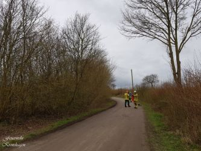

Am 01.04.2020 endete für Zugführer Timo Kretschmer der Wochendienst des ElvD um 10:00 Uhr und er übergab das gereinigte Fahrzeug an den Wehrführer Christian Esselbach.
Der KdoW hatte noch nicht ganz seinen Platz vor der Haustür eingenommen, da musste er auch schon um 11:49 Uhr wieder los.
**THK 00 Baum auf Stromleitung** war die Info der IRLS Mitte. In den Heidenberger Weg ging die Fahrt. Schnell stellte sich aber heraus, dass es sich nicht um eine Stromleitung handelte in der der Baum hing, sondern eine Telefonleitung.
 |  |   
---|---|---  
Blitzschnell konnten die Kameraden mittels Motorkettensäge das Malheur beseitigen und den Baum beiseite räumen.   
Die Leitung hatte keinen Schaden genommen und so freut es uns natürlich, dass die Endnutzer der Leitung weiterhin mit ihren Lieben telefonieren können.
**Nach dem Motto:** Kronshagen zeigt Corona die rote Karte und bleibt zuhause.
Christian Esselbach   
Gemeindewehrführer
Ihre und eure Feuerwehr Kronshagen  
Zuverlässig. Professionell. Vor Ort.
