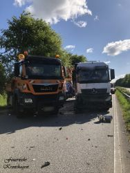
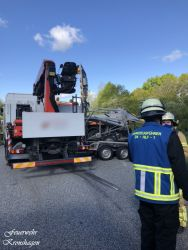
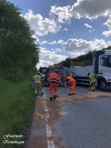
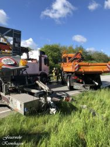
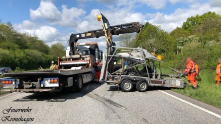

Am 14.05.20 um 9:15 Uhr wurde die Feuerwehr Kronshagen zu einem Verkehrsunfall auf die A210 gerufen. Ein LKW mit Baumaterial war in ein Absperrfahrzeug der Straßenmeisterei gefahren.
Auf der Anfahrt wurde dem Einsatzleitwagen mitgeteilt, dass keine Personen in den Fahrzeugen eingeklemmt waren und die Verletzen vom Rettungsdienst bereits behandelt wurden.
Die Anfahrt der Fahrzeuge der Feuerwehr Kronshagen gestaltete sich als schwierig. Durch den fehlenden Standstreifen auf diesem Stück der Autobahn und der Vielzahl an LKWs die im Stau standen, war die Rettungsgasse sehr eng. Die Maschinisten der Fahrzeuge mussten teils Millimeterarbeit bei der Durchfahrt leisten. Eine Ordnung des Raumes war fast nicht möglich, da Fahrzeuge in die Unfallstelle gefahren sind.
Nachdem sich der Einsatzleiter zusammen mit den Fahrzeugführern einen ersten Überblick von der Unfallstelle verschafft hatte, wurde der Brandschutz mit einem Angriffstrupp sichergestellt und die Besatzung des Rüstwagens fing die auslaufenden Betriebsstoffe aus dem aufgefahrenen LKW auf. Auf Grund der gemeldeten Probleme mit der Rettungsgasse fuhren 2 RTWs aus Richtung Felde kommend entgegengesetzt der Fahrtrichtung, auf Weisung der Autobahnpolizei NMS, der Unfallstelle entgegen um die Verletzten aufzunehmen.
Diese wurden in umliegende Krankenhäuser verbracht. Glück im Unglück war, dass niemand schwer verletzt war. Nach umfangreichen Bergungs- und Reinigungsarbeiten konnten die Kräfte aus Kronshagen nach ca. 2 Stunden wieder abrücken.
Positiv zu bewerten war die Geduld der im Stau stehenden Autofahrer und die sehr gute Zusammenarbeit mit den Beamten der Autobahnpolizei Neumünster und der Polizeizentralstation Kronshagen.
Christian Esselbach   
Einsatzleiter
 |  |   
---|---|---  
 |  | 
