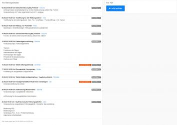

Nachdem es hier in der letzten Zeit ein wenig ruhiger geworden ist, wollen wir heute mal wieder etwas von uns hören lassen.
**Ausbildungsbetrieb bei der Feuerwehr Kronshagen**
Nach einer Konzeptvorlage des Kreisfeuerwehrverbandes RD-ECK haben wir die Möglichkeit unter Beachtung der Hygieneregeln mit maximal 9 Kameraden ab dem 05.06. wieder zu üben. Dies spiegelt die erste von insgesamt 4 Phasen des Konzeptes zur Wiederaufnahme des Übungsdienstes wieder.
Um möglichst allen Kameraden gerecht zu werden, wurden auf unserer Kommunikationsplattform „IServ“ verschiedene Themen angeboten.   
Unsere Kameraden können sich dort anmelden und für sich interessante Themen auswählen und buchen. Der Verantwortliche für den Themenabend kann dann automatisch Teilnehmerlisten für die geforderte Dokumentation erstellen. Vor Beginn der Ausbildung am 05.06. muss die Umsetzungsidee allerdings noch durch den Träger der Feuerwehr genehmigt werden.   
Bis dahin nutzen unsere Gruppenführer auch weiterhin die Möglichkeit über IServ Onlinevorträge per Videokonferenz zu halten.  
Wie genau wir IServ für den weiteren Dienstbetrieb nutzen, erklären wir euch in einem der nächsten Beiträgen.

**Maßnahmen COVID 19**
Die im März eingeführte Funktion EvD (Einsatzleiter vom Dienst) mit dem 24h besetzten Kommandowagen konnten wir auf Grund der positiven Entwicklung rund um COVID 19 vorerst einstellen. Sollte es die Lage erfordern, werden wir diese Funktion kurzfristig wieder einführen. Der bereits erstelle Dienstplan für den EvD läuft im Hintergrund weiter.
Timo Kretschmer
Ihre und eure Feuerwehr Kronshagen  
Zuverlässig. Professionell. Vor Ort.
