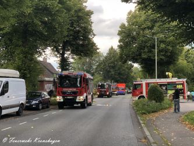
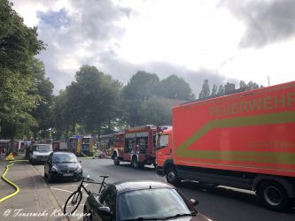
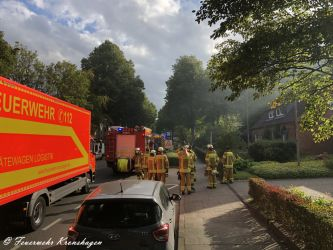
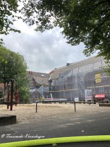
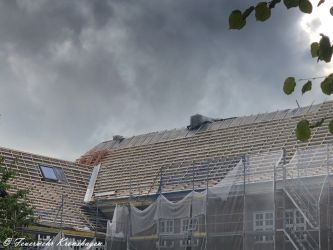
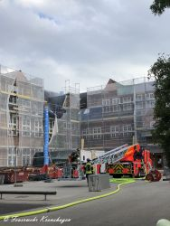

Am späten Nachmittag des 07.08.2020 wurde die Feuerwehr Kronshagen mit dem Stichwort "Feuer G 00 Y, bestätigter Dachstuhlbrand, Personen noch im Gebäude" in die Kopperpahler Allee zur ehemaligen Brüder-Grimm-Schule gerufen. Bereits 4 Minuten nach Alarmierung war das erste Fahrzeug aus Kronshagen an der Einsatzstelle.
Der Einsatzleiter wurde von einem Mitarbeiter und der Polizei in Empfang genommen und zum hinteren Schulhof geleitet. Dort stand ein Teilstück des Daches bereits in Brand. Die Polizei teilte vorab mit, dass sich keine Personen mehr im Gebäude befinden. Die eintreffende Drehleiter der Feuerwehr Kiel wurde auf den hinteren Schulhof geleitet und dort in Stellung gebracht. Das HLF 3 aus Kronshagen bekam dann den Auftrag, die Drehleiter für den Außenangriff mit Wasser über eine B-Leitung einzuspeisen.
Parallel dazu rüsteten sich weitere Kräfte aus Kronshagen mit Atemschutz und dem ersten C-Rohr für den Innenangriff aus und gingen ins 2. OG Richtung Brandherd vor.  
Da die Lage zu diesem Zeitpunkt noch dynamisch und das Schadensausmaß noch nicht ganz klar war, wurden die fertig ausgerüsteten Feuerwehrkräfte der von der Leitstelle mitalarmierten Feuerwehr Ottendorf gleich zur Aufnahme der Dachpfannen und Zuarbeit für die Drehleiter eingeteilt. Da an der Schule zu Zeit umfangreiche Renovierungsarbeiten durchgeführt werden, konnten sich die Kräfte über ein Baugerüst Zugang zum Dach verschaffen.
Zeitgleich ging ein zweiter Trupp der Kronshagener Wehr in das Gebäude vor, um sicherzustellen, dass sich keine weiteren Personen im Gebäude aufhielten. Alle Räume wurden, unter ständiger Durchgabe des Standortes, vom zweiten Trupp aus Kronshagen abkontrolliert. Nach kurzer Zeit konnte zweifelsfrei gemeldet werden, dass keine Personen im Gebäude sind.  
Um die Einsatzkräfte besser koordinieren zu können, wurde die Einsatzstelle vom Einsatzleiter in zwei Abschnitte aufgeteilt. Der Fahrzeugführer des HLF 3 hatte den Auftrag bekommen den Innenangriff zu führen, der Abschnittsleiter Außenangriff hatte den Auftrag die Drehleiter zu unterstützen. Glück im Unglück war, dass das Feuer sich noch nicht durch die Verschalung des Daches gefressen hatte und letztendlich schnell unter Kontrolle zu bringen war.
Simultan zu den Löscharbeiten im Außenbereich wurden von dem Angriffstrupp der Innenbereich unter dem Feuer mit Wärmebildkamera überwacht, um auszuschließen, dass das Feuer in den Innenraum schlägt. Der Trupp "außen" musste wegen der Länge der Löscharbeiten mehrfach durch frische Kräfte ersetzt werden.
Um 18:12 Uhr konnte die Feuerwehr Kronshagen "Feuer aus" melden und alle Kräfte konnten die Einsatzstelle aufklaren. Die Feuerwehr Ottendorf wurde dann auch zeitig aus dem Einsatz entlassen, die Einsatzkräfte aus Kronshagen kontrollierten sicherheitshalber nach getaner Arbeit das Obergeschoss nochmals mit Wärmebildkamera ab und konnte dann auch einrücken. Nach 1,5 Std. aufklaren der Gerätschaften in der Wache Kronshagen und der Wiederherstellung der Einsatzbereitschaft wurde wie üblich bei Einsätzen nochmal einen Nachbesprechung mit allen Einsatzkräften durchgeführt.
Pro und Contra des Einsatzverlaufes wurden, wie üblich nach Einsätzen, angesprochen.  
Gleich danach konnten alle Einsatzkräfte in den verdienten Feierabend entlassen werden.
Einsatzleiter  
Christian Esselbach
 |  |   
---|---|---  
 |  | 
