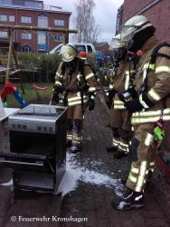

Heute um 14:14 Uhr wurde die Feuerwehr Kronshagen mit dem Stichwort FEU K 00 zu einem vermuteten Kabelbrand alarmiert.
Vor Ort stellte der Fahrzeugführer des ersten HLF bei der Erkundung eine Rauchentwicklung in der Küche fest. Das Einsatzstichwort wurde daraufhin auf FEU 00 angepasst und weitere Kräfte in den Einsatz gebracht.
Durch den Besitzer der Wohnung erfuhren wir, dass sich keine Personen mehr in der Wohnung befanden und in der Küche in einem Schrank ein Kabelbrand vermutet wurde.  
Ein Trupp ging unter schwerem Atemschutz vor und konnte einen Entstehungsbrand am Herd mittels Kleinlöschgerät ablöschen und die vom Feuer betroffenen Teile ins Freie bringen. Die Wohnung wurde anschließend belüftet. Der Rettungsdienst untersuchte derweil die betroffnen Personen. Eine weitere Behandlung im Krankenhaus war allerdings nicht erforderlich.
Ihre und eure Feuerwehr Kronshagen  
Zuverlässig. Professionell. Vor Ort.

