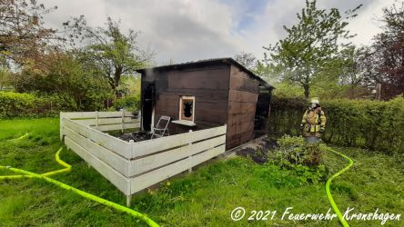
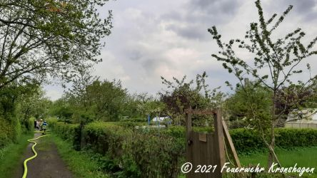

Am Montag den 17.05. wurde ein Flächenbrand auf einem Kleingartengelände gemeldet.
Das erste Löschgruppenfahrzeug rückte mit 4 Feuerwehrleuten aus und stellte beim Eintreffen fest, das eine Gartenbude in Vollbrand stand.
Der Einsatzleiter erhöhte daraufhin das Einsatzstichwort und ließ Alarm für einen Löschzug auslösen
Mit einem C-Rohr wurde die Brandbekämpfung durch den Angriffstrupp unter schwerem Atemschutz begonnen.
Das zweite Fahrzeug baute die Wasserversorgung vom Hydranten auf, stellte den Sicherheitstrupp und übernahm die Nachlöscharbeiten.
Mit Mannschaftstransportwagen und dritten Löschgruppenfahrzeug kamen weitere Einsatzkräfte zur Unterstützung.
Nach 20 Minuten konnte Feuer aus gemeldet werden. Nachlösch- und Aufräumarbeiten sowie die Wiederherstellung der Einsatzbereitschaft dauerten bis 20:30 Uhr.
Freiwillige Feuerwehr Kronshagen
Lars Mücke
 |  |   
---|---|---
