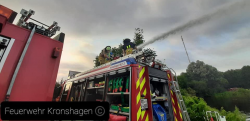
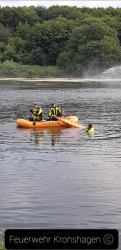
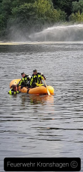

Am Montag war es wieder soweit. Die Kameraden der Feuerwehr Kronshagen trafen sich zum Sommerdienst. Diesmal ging es zum Domänetal.
Da der See durch die Hitze der vergangenen Wochen doch sehr erwärmt wurde und dies auch den Algenwuchs begünstigt, was wiederum den Fischen den Sauerstoff raubt, entschloss man sich den Übungsdienst dorthin zu verlegen.
Dies kam auch auf Grund einer Anfrage des Bauamtes zustande, das darum gebeten hatte. Auf dem Programm stand Wasserentnahme aus offenen Gewässern, Wasserabgabe über Dachwerfer und Strahlrohr und die Wasserrettung.
So konnte man nicht nur das erlernte festigen und trainieren, sondern auch den Fischen durch die Aktivitäten am See etwas Luft verschaffen.   
Eine gute Sache, die den Kameraden wieder viel Spaß bereitet hat.
Ihre und eure Feuerwehr Kronshagen
 |  |   
---|---|---
