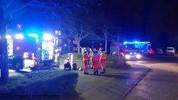
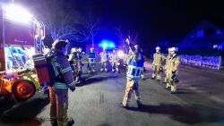
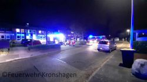

Am gestrigen Mittwoch, den 22.12.2021, wurde die Feuerwehr Kronshagen zu einer technischen Hilfeleistung alarmiert.
Ein Kleinkind hatte sich in eine missliche Lage gebracht und musste durch die Einsatzkräfte befreit werden. Im Laufe des Einsatzes wurden wir dann zu einem zweiten Einsatz gerufen. Rauchentwicklung in einem Pflegeheim in Kronshagen. Da einige Einsatzkräfte bei der TH Lage gebunden waren, wurden die Kameraden der Feuerwehr-Ottendorf automatisch mitalarmiert. Die Herkunft der Rauchentwicklung konnte schnell lokalisiert werden und der Schwelbrand in einem Lichtschacht mittels Kübelspritze durch die Ottendorfer Kameraden gelöscht werden. Den Innenbereich kontrollieren die Kameraden aus Kronshagen unter Atemschutz und Wärmebildkamera ab, nach Querlüftung konnte die Einsatzstelle an den Betreiber übergeben werden.
So macht Zusammenarbeit Spaß und produziert ein Maximum an Sicherheit für die Bürger in Kronshagen.  
Beste Grüße nach Ottendorf von unserer Seite und danke für die gute Zusammenarbeit.
 |   
---|---  
 | 
