### 50 jähriges Jubiläum der Jugendfeuerwehr Kronshagen
Am 10. Oktober 2015 wurde im Bürgerhaus in Kronshagen das 50 jährige Jubiläum der Jugenfeuerwehr gefeiert. In diesem Beitrag finden Sie die Artikel der Kieler Nachrichten sowie einige Fotos der Veranstaltung.
#### Zeitungsartikel:
|   
---|---  
 | Artikel zu dem 50 jährigen Jubiläum der Jugendfeuerwehr Kronshagen aus den Kieler Nachrichten vom 09.10.2015.  
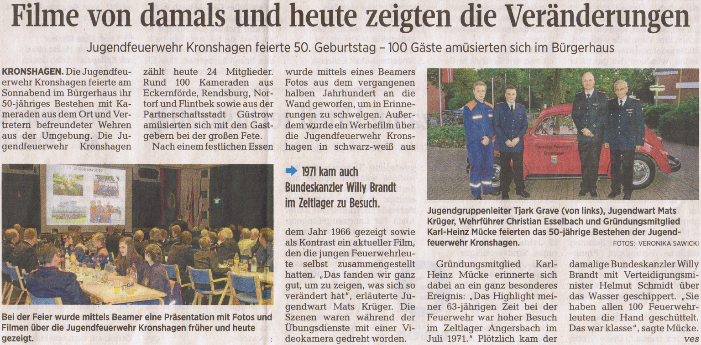 | Artikel zu der Jubiläumsfeier im Bürgerhaus Kronshagen aus den Kieler Nachrichten vom 12.10.2015.  
#### Fotos der Veranstaltung:
|   
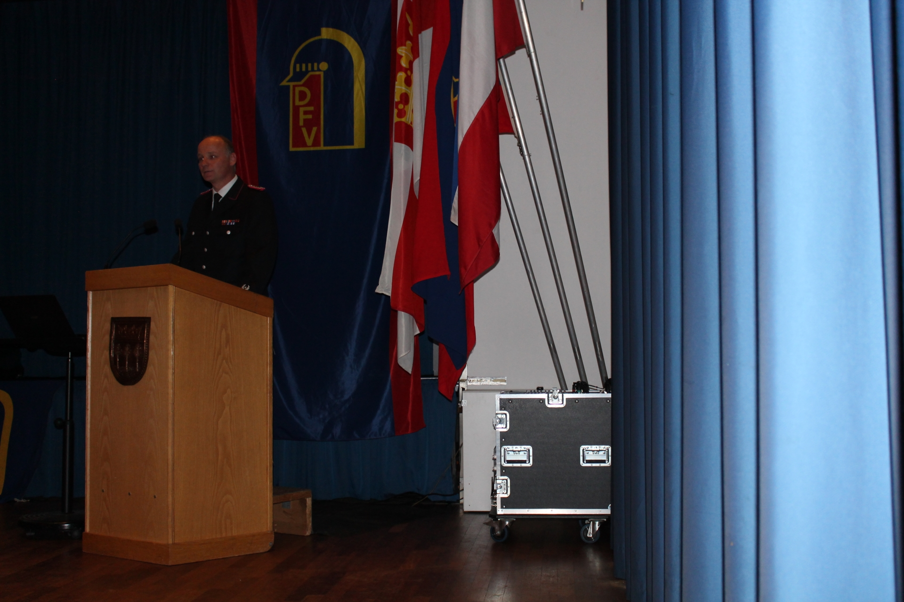 | Wehrführer Christian Esselbach eröffnet die Versammlung  
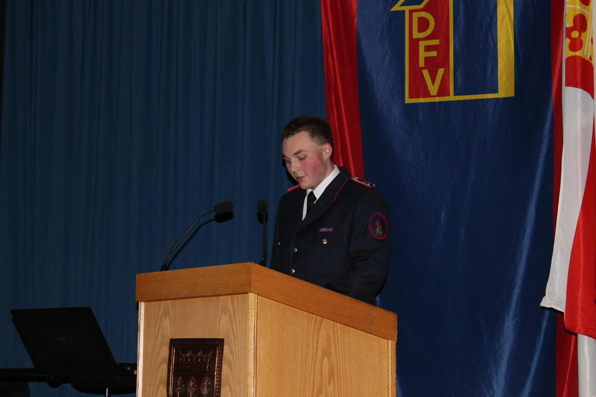 | Jugendwart Mats Krüger bei seiner Eröffnungsrede  
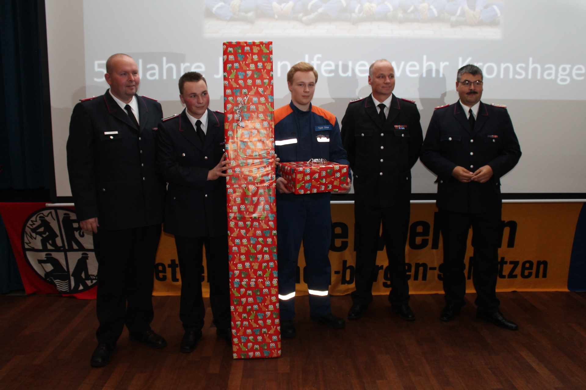 | Christian Esselbach, Lars Mücke und Helge Thomsen übergeben das Geschenk (Beamer und Leinwand) der aktiven Kameraden an den Jugendwart Mats Krüger und den Jugendgruppenleiter Tjark Grave.  
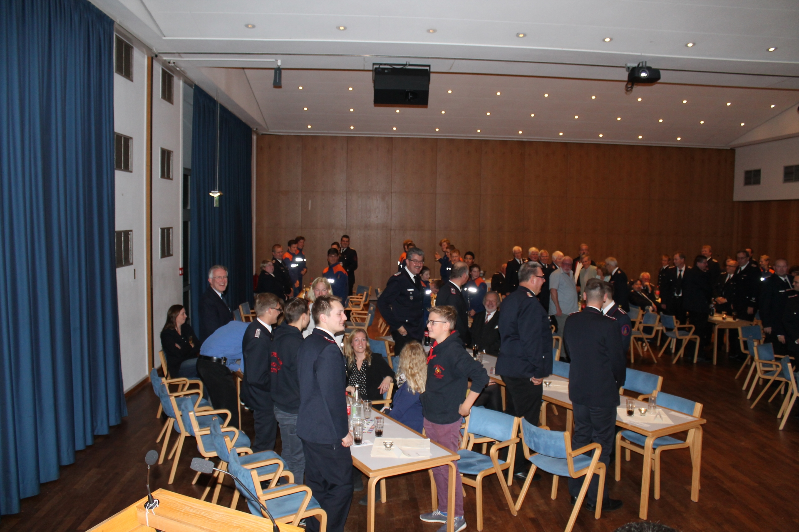 | Stehend: Alle Personen mit Bezug zur Jugendfeuerwehr  
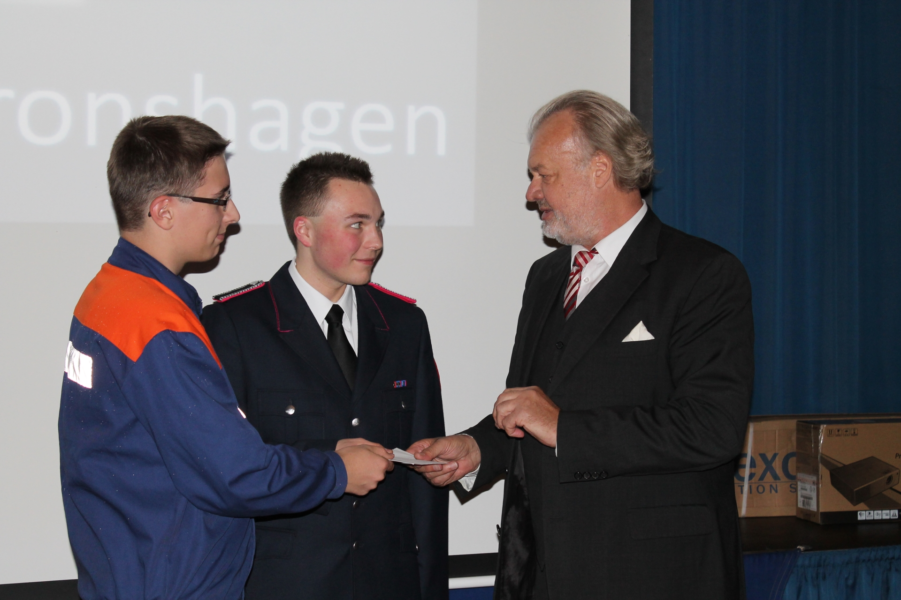 | Bürgervorsteher Bernd Carstensen übergibt ein Präsent an den Kassenwart der Jugendwehr Tim Graupner und Jugendwart Mats Krüger.  
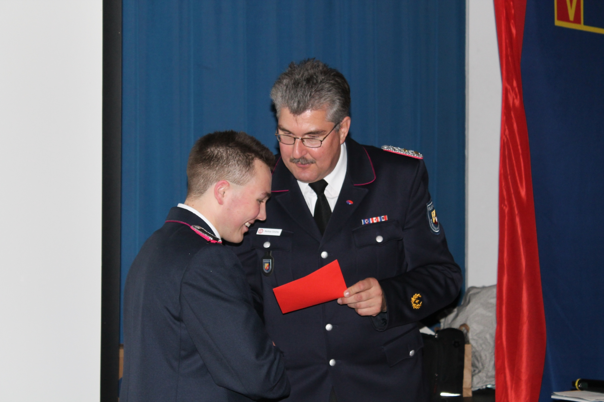 | Kreisbrandmeister Matthias Schütte übergibt das Präsent des Kreisfeuerwehrverbandes  
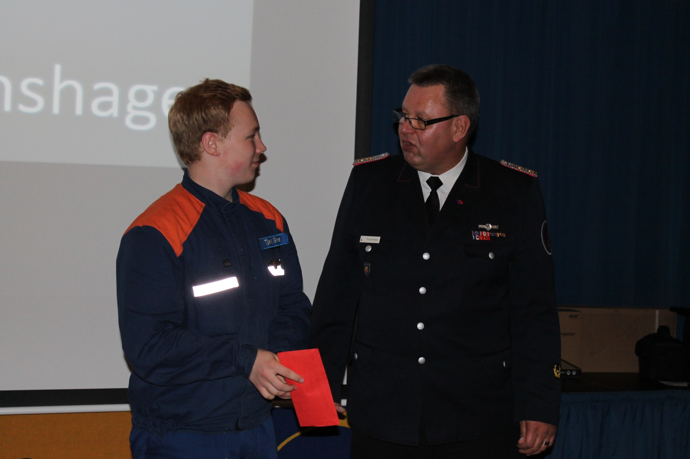 | Kreis-Jugendwart Thorsten Weber überbringt die Grüße und das Präsent der Kreisjugendfeuerwehr  
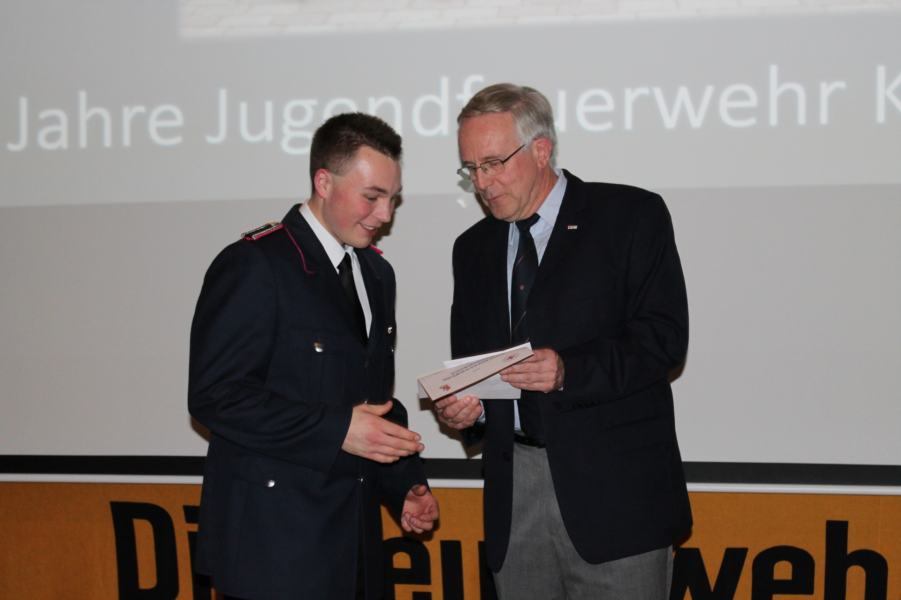 | DRK OV-Vorsitzender Reinhard Müller überbringt die Glückwünsche des DRK  
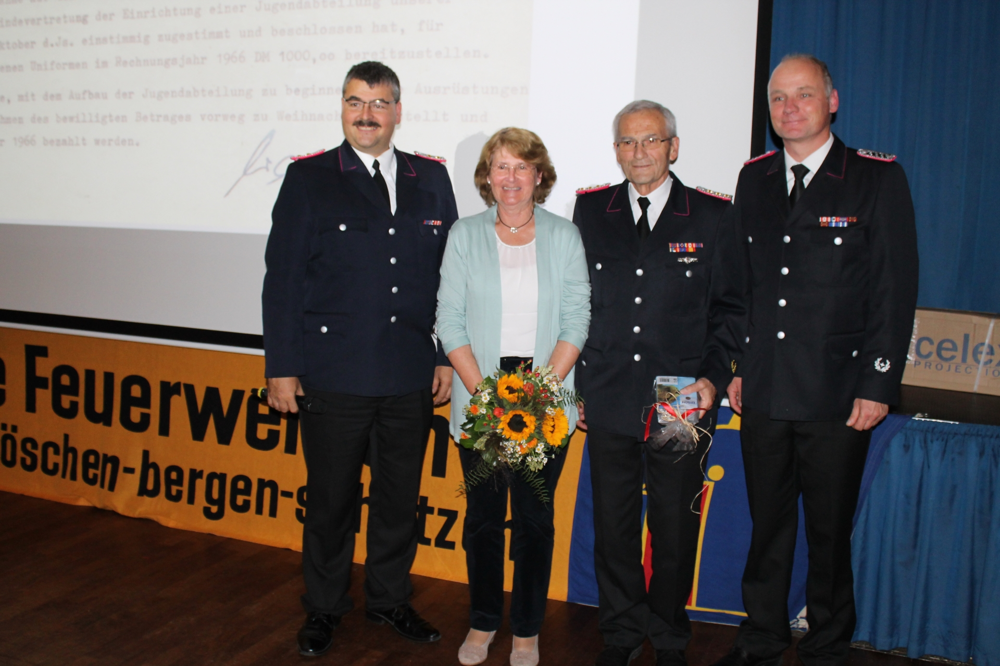 | Wehrführer Christian Esselbach und sein Stellvertreter Lars Mücke bedanken sich bei Karl-Heinz Mücke und seiner Frau Gertruida für die tolle Chronik über 50 Jahre Jugendfeuerwehr Kronshagen.  
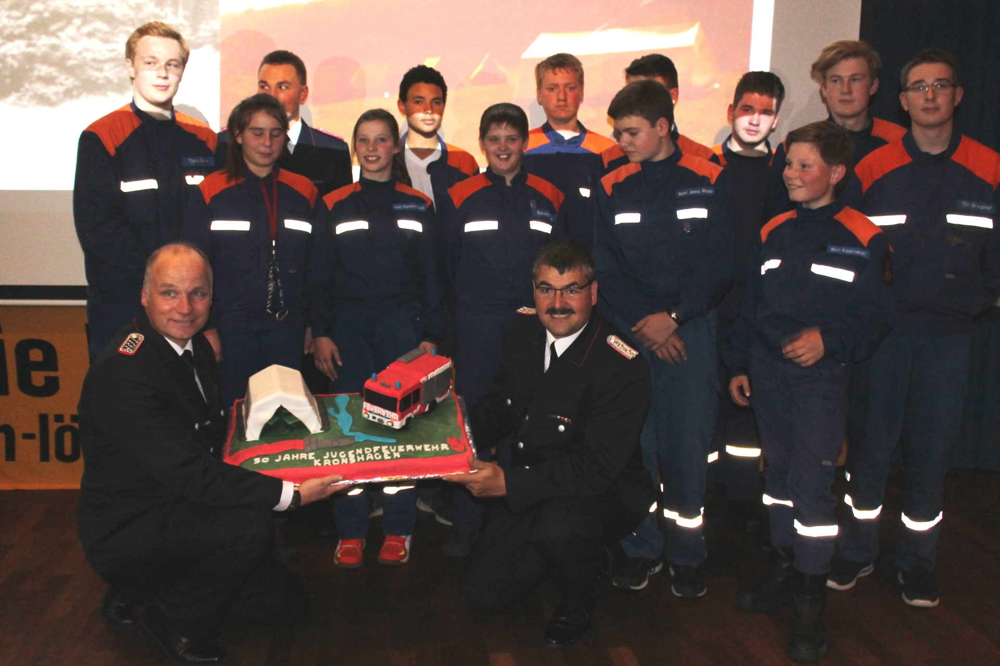 | Wehrführer Christian Esselbach und sein Stellvertreter Lars Mücke übergeben zum Ende der Veranstaltung einen Kuchen an die JF
