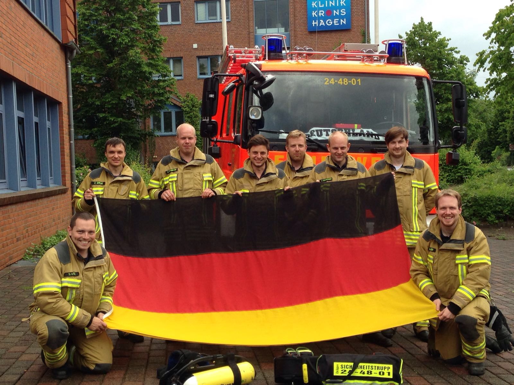

Zum heutigen Viertelfinalspiel hat sich nicht nur die Nationalmannschaft gut vorbereitet.
Auch bei der Feuerwehr Kronshagen stand heute wieder ein Sondertraining zum Thema Atemschutznotfall auf dem Programm.Um 9:00 fanden sich 10 Atemschutzgeräteträger ein, um gemeinsam den Umgang mit der neuen Atemschutznotfalltasche zu trainieren. Nachdem erneut die drei unterschiedlichen Möglichkeiten der Rettung durch die Trupps geübt wurden, wurde der Umgang mit der Rettungsschere geübt, für den Fall, dass sich ein Kamerad einmal in einem Seil, Kabel oder ähnlichem verfängt und sich nicht mehr selbst befreien kann. Nachdem die Übungen soweit beendet waren, wurde noch die Entrauchung von Gebäuden mittels Hohlstrahlrohr durchgeführt. Nach einer gemeinsamen Stärkung galt es dann die Einsatzbereitschaft wieder herzustellen, damit wir jederzeit- auch heute Abend während des EM-Spiels- für den Ernstfall gerüstet sind.
weitere Bilder folgen...

