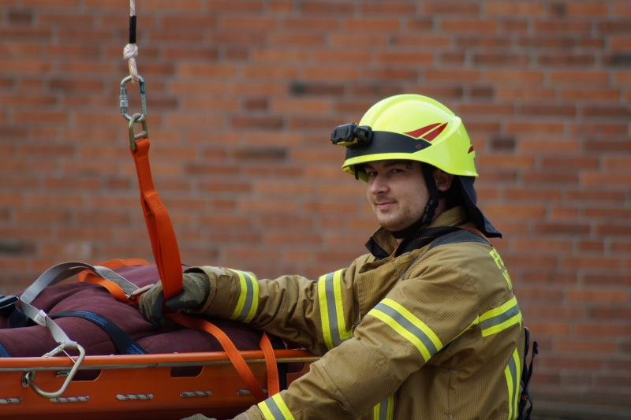

Ereignisreiches Wochenende
Für viele Kameraden stand das vergangene Wochenende wieder ganz im Zeichen der Feuerwehr.
Los ging es bereits am Freitag um 14:30 Uhr mit einer gemeinsamen Übung bei unseren Kameraden der FF Ottendorf. Grund war ein Lehrgang für zukünftige Notärzte, welcher bei der in Ottendorf ansässigen Schule Medi Learn stattfand. An insgesamt 3 Pkw wurde das Vorgehen bei einem Verkehrsunfall trainiert. Es wurde großes Augenmerk auf die Zusammenarbeit zwischen Feuerwehr und Rettungsdienst, hier speziell der angehenden Notärzte gelegt.
Im Anschluss hatten die Lehrgangsteilnehmer, die allesamt schon Ärzte sind und sich nun zu Notärzten qualifizieren und unsere Kameraden aus Ottendorf selbst auch noch einmal die Möglichkeit, mit den hydraulischen Rettungsgeräten zu arbeiten.
Am Samstagmorgen um 8:30 Uhr ging es für die Gruppe der Absturzsicherer gleich weiter. Die Kameraden sind speziell im Umgang mit den Gerätesätzen Absturzsicherung, sowie dem Auf- und Abseilgerät "Rollgliss" geschult, um im Einsatz eigene Kräfte bei Arbeiten in der Höhe zu sichern, bzw. Personen aus Höhen und Tiefen zu retten. Im Bereich der Kieler Straße/Seilerei steht momentan ein großer Baukran mit einer Höhe von 45 Metern, was wir zum Anlass genommen haben, diesen einmal zu beüben.
Ziel der Übung war es, bei einem etwaigen Unfall oder einer Erkrankung des Kranführers, diesen und die eingesetzten Kräfte zu sichern und einen Abtransport des Kranführers vorzubereiten. Als Bonus wurde noch die neue Abseilspinne der Schleifkorbtrage ausprobiert und unsere Übungspuppe auf ca. 40 Meter heraufgezogen. Dies verlangte den beiden Kameraden im Gitterturm einiges ab, da aufgrund der Höhe und einer Seillänge von 60 Meter nicht mit einer losen Rolle gearbeitet werden konnte und das Gewicht von Trage und Puppe 1:1 gezogen werden musste.
Ein besonderer Dank geht an die Firma Reese Baugeschäft aus Bordesholm, die uns das Betreten der Baustelle gestattete und extra einen Mitarbeiter schickte, der uns etwas über den Kran erzählte.
Zurück im Gerätehaus, die Besprechung der Übung lief gerade, klingelten uns unsere Digitalmelder zur Pflicht. Mit dem Stichwort "Brandmeldeanlage, Menschenleben in Gefahr" wurden wir gemeinsam mit den Feuerwehren des Amtes Achterwehr ins Cura Seniorenzentrum im Ottendorfer Weg alarmiert.
Hier war aus unbekannten Gründen ein Feuer ausgebrochen und es galt mehrere Menschen zu retten und die Brandbekämpfung einzuleiten. Zum Glück stellte sich der Einsatz als groß angelegte Übung heraus,da ein Ernstfall in Seniorenheimen immer ein großes Risiko durch nicht gehfähige oder bettlägerige Bewohner darstellt.
Der stellvertretende Wehrführer nahm an dieser Übung nicht Teil. Er ist ebenfalls früh morgens mit unseren Kommandowagen, kurz KoWa, nach Eutin gefahren, um dort an einem Oldtimertreffen teilzunehmen.
Da nach so viel Arbeit die Kameradschaftspflege auch nicht zu kurz kommen darf, haben sich direkt von der Einsatzstelle 2 Kameraden nach einem kurzen Stop unter der Dusche auf den Weg in Kronshagens Partnerstadt Güstrow gemacht, um dort am 25. jährigen Jubiläum der Jugendfeuerwehr der Barlachstadt Güstrow teilzunehmen. Sie werden erst am Sonntag zurück kommen.
Sascha Utsch
Fotos der technischen Hilfe Übung bei der FF Ottendorf
 |  |   
---|---|---  
 |  |   
Fotos der Absturzsicherungsübung auf dem Baukran
 |  |   
---|---|---  
 |  |   

