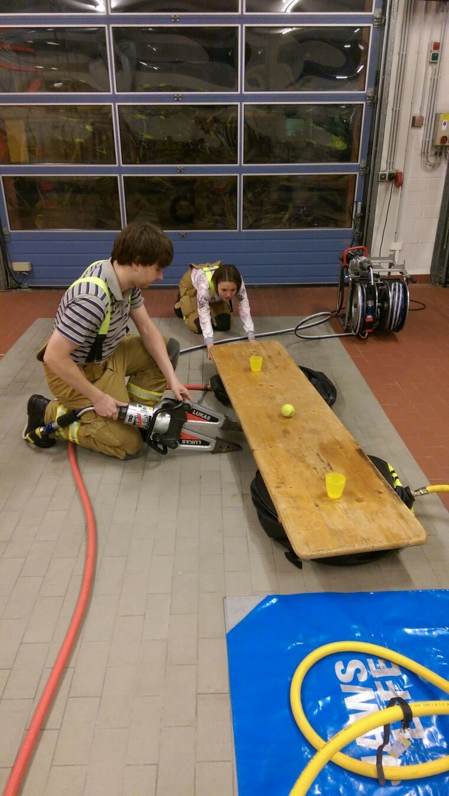

Den letzten Ausbildungsdienst im Jahr nutzte die 3. Einsatzabteilung, um auch mal auf anderen Wegen die erlernten Abläufe und Fähigkeiten zu vertiefen. Wie so oft war gute Kommunikation und Teamwork gefragt. Es galt 2 Aufgaben zu bewältigen, wobei der Spaß und auch der Ehrgeiz eindeutig im Vordergrund standen.
Kurzerhand wurden zwei Gruppen gebildet, die nacheinander die Aufgaben bewältigten.
Es galt einen Tisch anzuheben, auf dem 2 randvolle Gläser und ein Ball lagen. Der Tisch durfte nicht berührt und an Material nur das verfügbare, von dem uns zugewiesenen Löschfahrzeug genutzt werden.  
Kurzerhand wurde der Tisch von 2 Seiten mit Hebekissen vorsichtig angehoben und ein Kippen durch den Einsatz des hydraulischen Rettungssatzes verhindert.
Nachdem der ersten Gruppe der Ball recht schnell vom Tisch rollte, war das Grinsen beim Durchgang der zweiten Gruppe noch etwas größer, als der Ball wie auch die Gläser und der ganze Tisch abgeräumt wurde.
Bei der zweiten Aufgabe wurde die Fingerfertigkeit bzw. die Feinmotorik unter die Lupe genommen.  
Es sollte mit Hilfe des hydraulischen Spreizer, ein rohes Ei "gegriffen" und 6 Meter weiter wieder heil abgesetzt werden. Bei einem Arbeitsdruck von bis zu 700bar, war diese Aufgabe für den Einen oder Anderen ein echtes "Aha Erlebnis". Durch das Anfeuern in der Gruppe aufgeschreckt, kam unser Wehrführer vorbei, der sogleich zum Eierlauf verpflichtet wurde und sich gar nicht so schlecht geschlagen hat.
Ein amüsanter letzter Dienstabend, der zugleich eine Grundlage für das kommende Jahr stellte.
Daniel Peterßon  
Gruppenführer  
3\. Gruppe
Fotos des Übungsabend
 |  |   
---|---|---  
 |  |   
 |  |   
 |  |   
 |  |   
 |  |   
 |  | 
