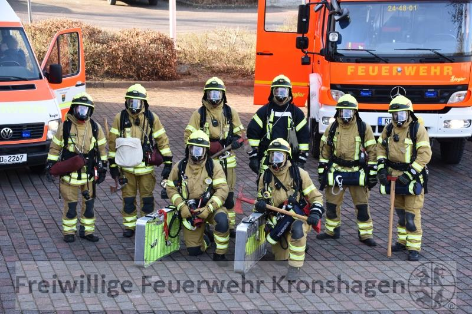
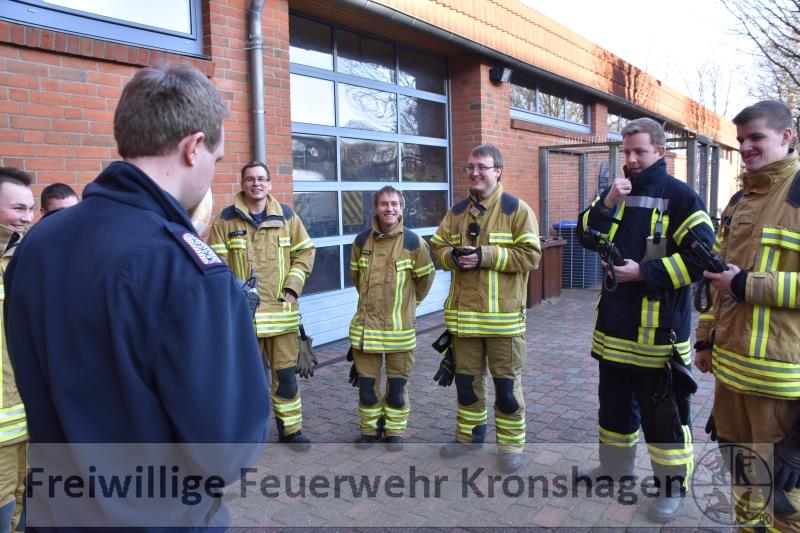
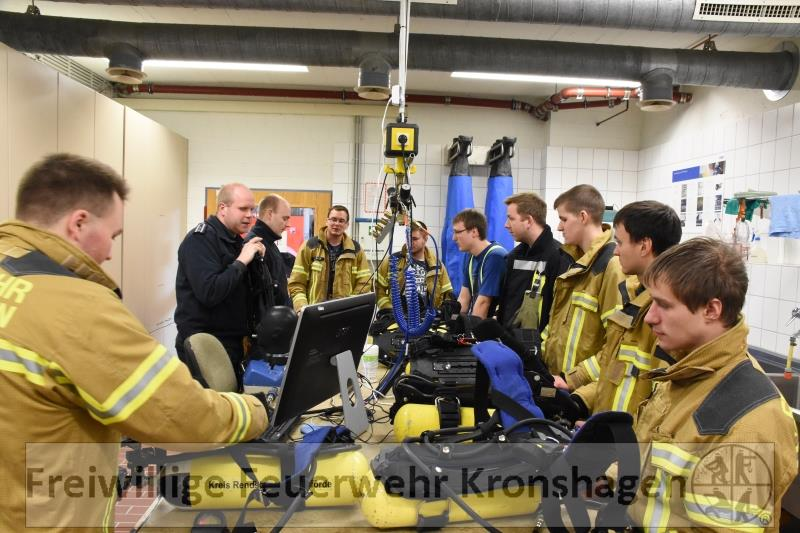
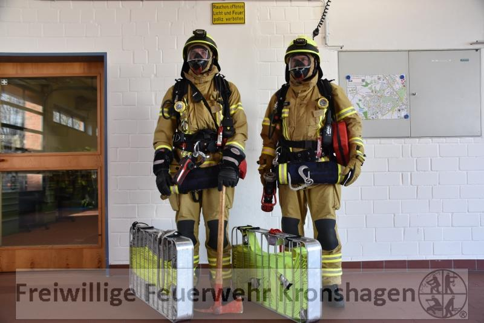
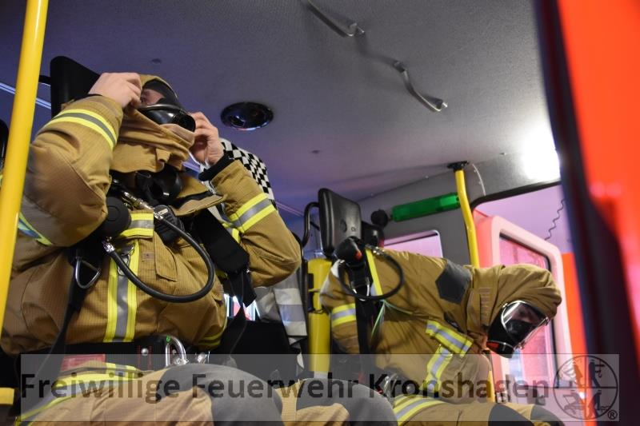
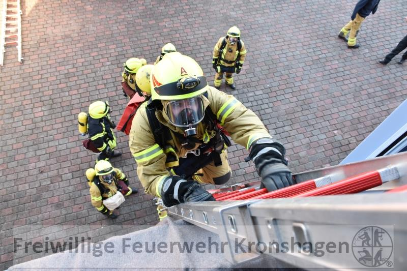
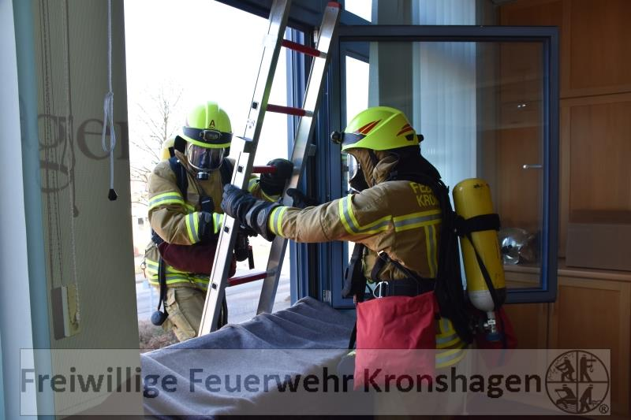

Am 28. Januar 2017 trafen sich einige Kameraden zu einem Sonderdienst Atemschutzausbildung. Ziel war es, vor allem Kameraden, die erst relativ kurz ihren Atemschutzlehrgang haben oder relativ kurz in der Feuerwehr Kronshagen sind, mit Grundlagen und örtlichen Gegebenheiten vertraut zu machen.
Der Tag begann mit einer Einweisung in die bei uns verwendeten Atemschutzgeräte inkl. Bedienelement "Bodyguard" und die Abläufe in unserer Atemschutzwerkstatt nach einem Einsatz. Danach folgte ein Vortrag zu Ausrüstungsstandards nach Dienstvorschriften, Einsatzgrundsätzen im Atemschutzeinsatz und Atemschutzüberwachung.  
Daran anknüpfend gab es praktische Fahrzeug- und Gerätekunde auf unseren verschiedenen Fahrzeugen in Bezug auf die darauf verlastete Ausrüstung für Atemschutztrupps im Brandeinsatz. Anschließend wurde das zügige vollständige Ausrüsten im Einsatzfall geübt. Hier ist das Ziel für die Zukunft, durch stetiges Üben die Ausrüstungszeit weiter zu verkürzen.
Zum Abschluss des Tages wurde das Einsteigen in ein Fenster im 1. Stock über eine Leiter mit dem Atemschutzgerät auf dem Rücken geübt.
Fotos der Atemschutzausbildung
 |  |   
---|---|---  
 |  |   
|  | 
