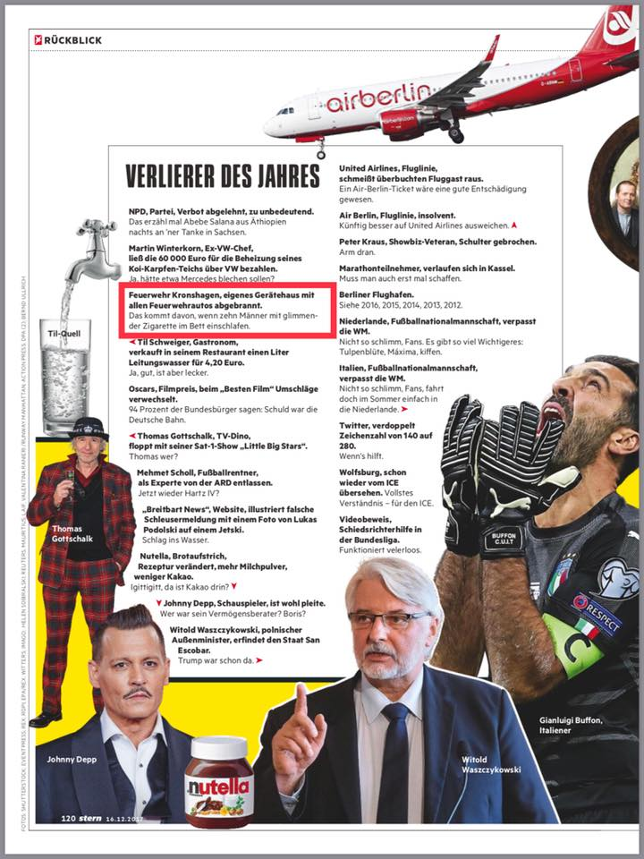

Liebe Follower, liebe Bürgerinnen und Bürger der Gemeinde Kronshagen, liebe Leser,
heute ist uns ein Bericht im stern Jahresrückblick in die Hände gefallen, in dem Wir, die Feuerwehr Kronshagen, als Verlierer des Jahres dargestellt werden.   
Der „Grund“, warum wir die Verlierer des Jahres sein sollen, wird mit dem Satz „das kommt davon, wenn 10 Männer mit glimmender Zigarette im Bett einschlafen“ in den Dreck gezogen, zumal wir uns als freiwillige Feuerwehrleute überhaupt nicht ständig im Gerätehaus aufhalten.   
Dies wollen wir so nicht stehen lassen.  

  
Beitrag aus dem stern-Sonderheft 'Jahresrückblick 2017'
Natürlich war das Feuer am 22. Februar ein herber Schicksalsschlag für uns. Als Verlierer sehen wir uns dennoch nicht.   
1\. ist es nur einem glücklichen Umstand zu verdanken, dass niemand bei dem Einsatz verletzt wurde.   
2\. wurde uns eine ungeheure Welle der Hilfsbereitschaft aus der gesamten Bundesrepublik und darüber hinaus entgegengebracht.   
3\. hat das Unglück uns näher zusammengebracht. Wir mussten gemeinsam erleben, wie es ist, auf der anderen Seite zu stehen.   
4\. ist die Feuerwehr Kronshagen innerhalb weniger Monate wieder vollumfänglich, mit allen Fahrzeugen einsatzbereit geworden ! Mit dem Bezug des neuen Gerätehauses ist im März 2018 zu rechnen. Dies alles war nur möglich, weil alle Beteiligten gemeinsam, eben wie Gewinnertypen, an einem Strang gezogen haben. Wir dürfen nicht vergessen, dass ein Schaden von mehreren Millionen Euro entstanden ist.
stern ist das der Dank dafür, dass die Kameradinnen und Kameraden der Feuerwehr Kronshagen allein in den ersten 3 Tagen nach dem Feuer über 600 Arbeitsstunden in die Wiederherstellung der Einsatzbereitschaft, der Schulung auf neue Fahrzeuge und ins Aufräumen investiert haben ?  
Ist das der Dank dafür, dass wir, die Freiwilligen Feuerwehren in Deutschland unsere Angehörigen zu jeder Tages- und Nachtzeit allein lassen, um anderen Menschen zu helfen ?  
Ist das der Dank dafür, dass wir nach einer Nacht im Einsatz morgen früh trotzdem noch zur Arbeit gehen ?  
Ist das der Dank dafür, dass einige Kameraden den ehrenamtlichen Einsatz mit ihrem Leben bezahlen ?
In Deutschland sind ca. 1 Million Frauen und Männer in einer der fast 23.000 Feuerwehren aktiv. Wir finden, dieser Beitrag ist nicht nur ein Tritt zwischen unsere Beine, sondern ein Tritt zwischen die Beine aller Kameradinnen und Kameraden, die sich bei Wind und Wetter für ihre Nachbarn engagieren.
Lieber stern, auch in der Hansestadt Hamburg gibt es eine Freiwillige Feuerwehr Hamburg. Genau genommen sogar 86 Stück. Vor Ort beim Dienstabend können sie sich sicher einmal von der Professionalität überzeugen.
Wenn ihr unsere Meinung vertretet, dann teilt unseren Beitrag auf [Facebook](https://www.facebook.com/permalink.php?story_fbid=1783734934992349&id=204556862910172&pnref=story "https://www.facebook.com/permalink.php?story_fbid=1783734934992349&id=204556862910172&pnref=story") gerne weiter.  
  

Herzlichst,  
die Kameradinnen und Kameraden der Freiwilligen Feuerwehr Kronshagen
