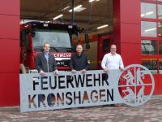

Was ist eine neue Fahrzeughalle ohne passendes Schild dachte sich Daniel Eggers. Selbst seit 2008 bei der Feuerwehr Kronshagen, machte er es möglich, dass der Familienbetrieb ein schönes Schild sponserte. Gleich mit im Boot waren Bruder Florian und Vater Ralf, die Daniel mit Rat und Tat zur Seite standen.

Von den Kameradinnen und Kameraden der Feuerwehr Kronshagen ein großes Danke an die Eggis.  
So sind wir in Kronshagen... einer für alle, alle für einen.
Am Donnerstag Abend fand wieder unser 3-wöchentliches Atemschutztraining statt.   
Eigentlich nichts ungewöhnliches, aber bei diesem Mal konnten wir 6 Kameraden der Feuerwehr Bredenbek begrüßen. Die Idee, ein gemeinsames Training abzuhalten kam durch einen ehemaligen Kronshagener Kameraden, der nun in Bredenbek sein zu Hause gefunden hat. Augenmerk lag auf unserem Warm-Up und der Handhabung verschiedener Schlauchpaketvarianten. Wir denken, es hat allen Beteiligten gefallen, die Gegeneinladung nach Bredenbek kam jedenfalls schon und wird auch gerne angenommen.
Bis denn dann...
Ihre und eure Feuerwehr Kronshagen
