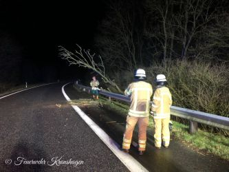

Am 04.03.2019 stürmte es kräftig in Teilen von Deutschland.  
Auch wir haben Spitzenboen von 12bft abbekommen. Kurz vor unserem regelmäßigem Dienstabend klingelten die Melder.
Die Vermutung, dass es sich um einen Sturmeinsatz handelt lag nah. Doch wir wurden zunächst zu einer Türöffnung für den Rettungsdienst gerufen. Wir konnten uns schnell Zutritt zur Wohnung verschaffen, kamen jedoch zu spät.   
In der Nacht legte der Sturm dann nochmals zu.
Gegen 1:30 Uhr klingelten erneut die Melder. Dieses mal war es dann tatsächlich ein Sturmschaden. Auf dem Autobahnzubringer A215/A210 ragte ein Baum auf die Fahrbahn. Wir übernahmen die Absicherungsmaßnahmen und entfernten den Baum.
Eure Feuerwehr Kronshagen   
Professionell.Zuverlässig. Vor Ort
