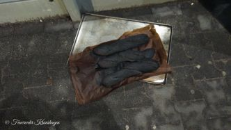
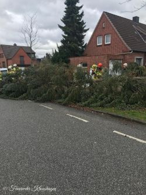
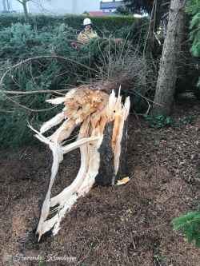

Am Donnerstag, den 07.03.2019 kam es gleich zu 5 Einsätzen für die Feuerwehr Kronshagen.
Bevor es für die meisten Kameraden morgens zur Arbeit ging, meldete sich zunächst einmal der Melder.
Gegen 5 Uhr löste die Brandmeldeanlage in einem Supermarkt aus. Nach erster Erkundung konnte eine Rauchentwicklung im Backbereich festgestellt werden. Ein Trupp unter Atemschutz ging vor, lokalisierte die Schadenstelle und leitete die Belüftung des Gebäudes ein.
Um 12:06 Uhr löste erneut eine Brandmeldeanlage in einer Schule aus. Hier konnte keine Schadenstelle ausgemacht werden.
 Gegen 12:30 Uhr wurden wir dann über Funk zum dritten Einsatz an diesem Tag gerufen. Auf Grund der Sturmböen stürzte ein Baum auf einen Gehweg. Zunächst wurde der Baum zersägt und anschließend die Fahrbahn und der Gehweg wieder passierbar gemacht.
Erneut klingelten die Melder. Um 14:37 ging es diese mal zu einer Türöffnung für den Rettungsdienst. Wir verschafften uns gewaltsam Zutritt zur Wohnung, konnten jedoch niemanden antreffen.
Und weil alle guten Dinge ja bekanntermaßen 3 sind, löste um18:43 Uhr eine weitere Brandmeldeanlage in einer Flüchtlingsunterkunft aus. Hier gab angebranntes Essen Anlass zur Alarmierung.
Das sollte es dann für den Donnerstag gewesen sein.
Eure Feuerwehr Kronshagen   
Professionell.Zuverlässig. Vor Ort
