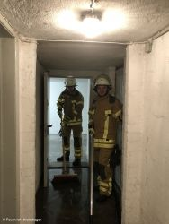
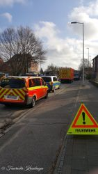
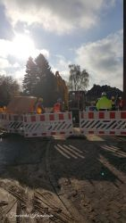

Am Montagmorgen wurden wir um 7:45Uhr zu einem Lenzeinsatz in die Kopperpahler Allee gerufen.
Nachdem es bereits in der Nacht zu einem Wasserrohrbruch in der Eckernförder Straße kam, waren die Versorgungsbetriebe Kronshagen und das Tiefbauamt vor Ort und forderten die Kräfte der Feuerwehr Kronshagen nach, um einen vollgelaufenen Gemeinschaftskeller zu lenzen. Wir setzten ingesamt eine Lenzpumpe und 3 Wassersauger ein, um die Fläche von 100m2 zu lenzen. Des Weiteren musste ein Kellerverschlag gewaltsam geöffnet werden. Einsatzende nach 2 Stunden für die Feuerwehr Kronshagen.
  
