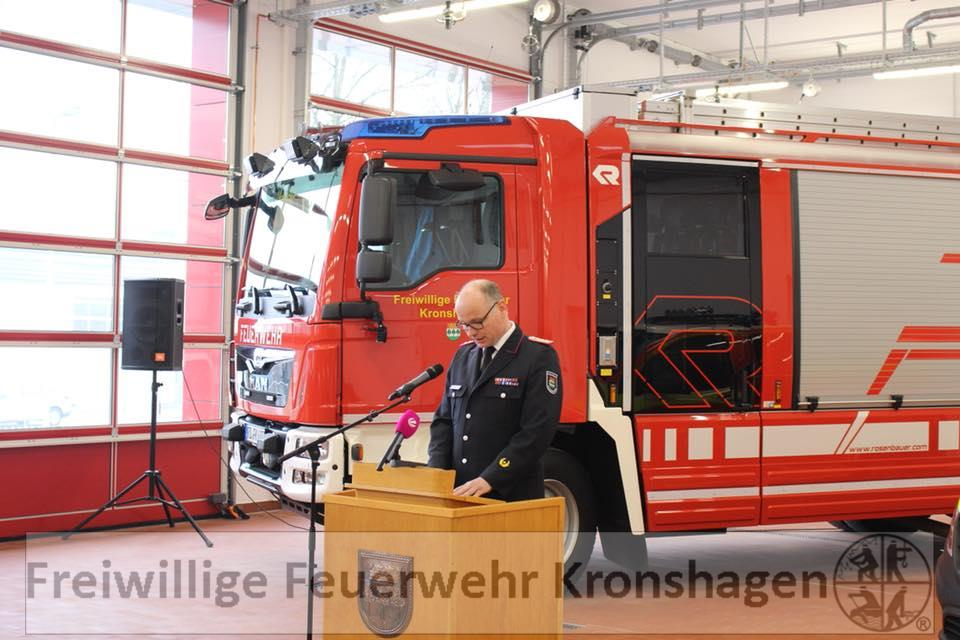
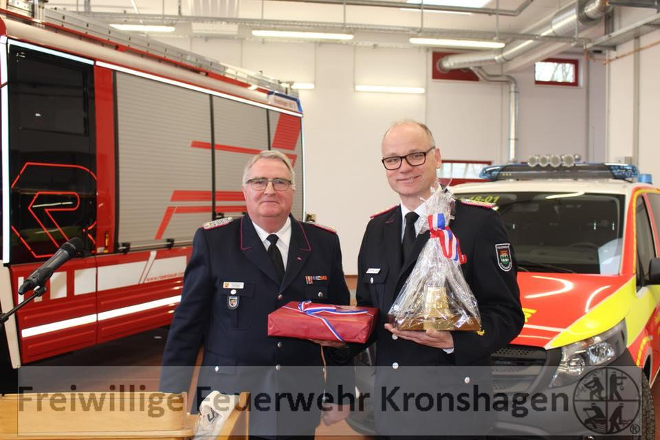
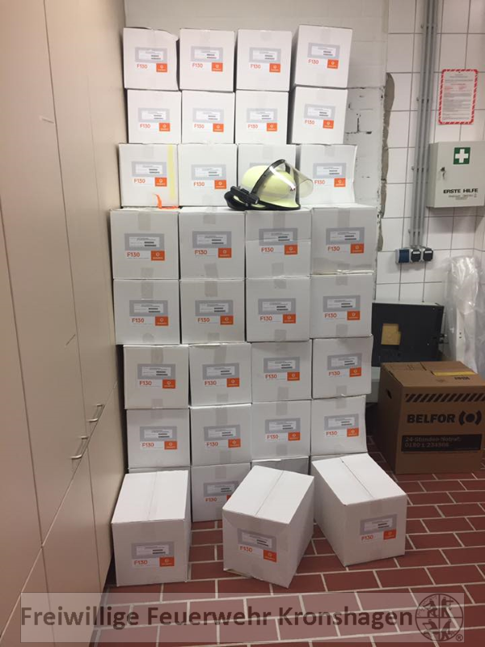

In diesem Artikel werden wir für Sie alle Informationen bezüglich des Brandes in unserer Fahrzeughalle zusammentragen und veröffentlichen.  
Bei Fragen, Angeboten oder sonstigen Anliegen in Bezug auf den Brand verwenden Sie bitte die E-Mail-Adresse Diese E-Mail-Adresse ist vor Spambots geschützt! Zur Anzeige muss JavaScript eingeschaltet sein!.

**Freitag, 13. April 2018**  
**Geschafft!****Wir sind zurückgezogen!**
Wie am Montag bereits angekündigt, konnten wir heute die neue Halle beziehen.  
Vorbereitet wurde der Umzug bereits am Morgen. Durch eine Fachfirma wurden die Kabel für die Bremsdruck- und Batterieladeerhaltung, die vor einem Jahr eingebaut wurden, nun wieder abgebaut und in der neuen Halle montiert. Um 14:00 Uhr schlug dann die Stunde der Kameraden. Um Platz zu schaffen, wurde zuerst die Schutzkleidung ausgeräumt und in den neuen Spinden aufgehängt. Nun haben wir endlich genug Platz um alles vernünftig zu verstauen. Nach den Fahrzeugen wurde dann auch alles andere zurückgebracht. Neben Sonderausrüstung auch unser provisorischer Funktisch nebst Geräten und Unterlagen, Schlüsselbunde, Kettensägen, Schläuchen und und und...  
Zum Schluss wurde die Halle gereinigt und ein letztes Mal von uns abgeschlossen.  
Wir können sie nun in einem 1A Zustand an die Mitarbeiter des Bauhofes zurückgeben. Ihr wart die ersten, die uns geholfen haben, nachdem die Feuerwehren abgerückt sind und ihr habt es am längsten mit uns ausgehalten.  
Vielen Dank dafür!
 |  |   
---|---|---  
Mit dem Umzug wird nun noch ein weiteres Kapitel geschlossen. Der Hashtag #BrandschadenFFKronshagen hat mit diesem 39. Update nun ausgedient.  
Wir sind froh, dass der Wiederaufbau vorbei ist, war es doch für viele Akteure sehr viel Mehrarbeit. Auf der anderen Seite haben wir euch gern an unserem Fortschritt und unserer Freude teilhaben lassen. Euer Zuspruch war gerade in den ersten Tagen Balsam für unsere Seele und es freut uns zu sehen, wie viele Leute sich für unsere Geschichte interessiert haben. Ihr habt euch mit uns gefreut, wenn wir neue Fahrzeuge und dergleichen bekommen haben und ihr habt auch gemeinsam mit uns geschimpft. Vergessen wollen wir auch nicht die vielen Hilfsangebote, die uns auch hier über Facebook erreicht haben. Vom zweiten Paar Stiefel, dass man entbehren konnte bis hin zu ganzen Löschfahrzeugen wurde uns alles angeboten, was man brauchte. Natürlich konnten wir nicht jedem Angebot entsprechen, aber dennoch sei euch an dieser Stelle noch einmal von ganzem Herzen gedankt. Ihr alle macht Feuerwehrdeutschland zu dem, was es ist!
  
© Sven Janssen |  |   
---|---|---  
Neben dem ganz normalen Dienstbetrieb und natürlich unseren Hauptberufen auch noch Facebook zu bedienen war nicht immer leicht aber es hat auch immer irgendwie gepasst. Ein Beitrag ist uns hierbei besonders im Gedächtnis geblieben, waren wir doch mehrere Tage damit beschäftigt, die Kommentare nach beleidigenden oder gewalttätigen Beiträgen zu durchsuchen. Aber auch diese Geschichte hat sich ja mittlerweile geklärt und wir legen sie zu den Akten der vergangenen 416 Tage.
Natürlich werden wir euch auch an dieser Stelle weiterhin mit Informationen versorgen, wenn auch nicht mehr so viel passieren wird. Ab sofort konzentrieren wir uns wieder ganz auf Einsatz und Ausbildung und natürlich auf die Einweihung am 01.09. Details folgen...Wir hoffen, ihr haltet uns trotzdem die Treue. Vielleicht kommen wir ja irgendwann einmal mit dem einen oder anderen auch persönlich ins Gespräch.
Bis dahin.  
Ihre und eure Feuerwehr Kronshagen
* * *
**Montag, 09. April 2018**  
Moin Moin,  
wir wollten mal wieder von uns hören lassen.
Am Samstag konnten die ersten Atemschutzgeräteträger mit dem Multifunktionsgurt BIG Fireliner ausgestattet werden. Der Gurt vereint unterschiedliche Möglichkeiten und bietet einige Vorteile gegenüber dem Feuerwehrhaltegurt. Beispielsweise kann er als Rettungsschlaufe für verunfallte Feuerwehrkameraden aber auch anderer Personen eingesetzt werden. Außerdem ist er ständig in der der Jacke eingezogen und kann somit nicht vergessen werden. Die Luftpolsterschicht in der Jacke wird ebenfalls nicht beeinträchtigt, was uns vor Verbrennungen schützt. Grundlage hierzu war eine Einweisung in das System. Nach mehreren Trockenübungen und der Wiederholung der gängigsten Knoten fand noch eine Selbstrettung aus dem 2. OG statt.  
Die Einweisung wurde freundlicherweise durch zwei Kameraden der Freiwillige Feuerwehr Melsdorf durchgeführt, da wir selbst erst im September die Multiplikatorenschulung besuchen können.  
Vielen herzlichen Dank dafür !!!
 |  |   
---|---|---  
 |  |   
Am Freitag nun soll es endlich soweit sein. Wir ziehen um. Besser gesagt ziehen wir zurück in die neue Fahrzeughalle am alten Platz. Hierfür ist ein Arbeitsdienst angesetzt, denn nicht nur Fahrzeuge und Schutzkleidung müssen zurück, auch alles andere, was wir in den letzten fast 14 Monaten dort gebraucht und gehortet haben, muss wieder mitgenommen werden.  
Die Vorbereitungen für den lang herbei gesehnten Tag sind auch schon in vollem Gange. Die Markierungen für die einzelnen Fahrzeuge wurden schon durch den Gerätewart aufgebracht, denn das Auge parkt ja bekanntlich mit oder wie war das? Die Spinde haben auch schon ihre Nummern bekommen, damit dann ab Freitag jeder weiß, wo sein Platz ist und die Transponder für die Schließanlage sind auch programmiert und warten auf die Verteilung. Wir werden euch den Tag über in unserer Story auf dem Laufenden halten.
 |  |   
---|---|---  
Das war es für den Montag, wir halten jetzt noch unseren 14 tägigen Dienstabend ab und freuen uns dann auf Freitag.
Übrigens: für interessierte Kronshagenerinnen und Kronshagener haben wir noch ein paar Spinde frei...
  
Ihre und eure Feuerwehr Kronshagen
* * *
**Donnerstag, 29. März 2018**  
Moin Moin am Gründonnerstag!
Die Updates werden kürzer, es geht also dem Ende entgegen. Nichtsdestotrotz geht es im stillen Kämmerlein stetig weiter. So ziemlich kurz vor Schluss wurde nun die Absauganlage komplett montiert und an die Fahrzeuge angepasst. Dazu mussten sie auch alle schon einmal in die Halle gefahren werden. Der GW/L sieht ja schon mal ganz schnieke aus finden wir.
 |  |   
---|---|---  
Von organisatorischer Seite her können wir euch auch schon wieder einen Ausblick geben: wir haben lange überlegt um einen Termin zu finden und durch andere Veranstaltungen, die im Ort stattfinden, der Kieler Woche und zu guter Letzt auch den Sommerferien haben wir uns einen Termin nach den Ferien ausgesucht. Unsere große Eröffnungsfeier findet also am Samstag, den 01. September 2018 statt. Schon mal merken. Details und Uhrzeiten folgen dann später.
Im letzten Status-Update haben wir noch von Ostern im Schnee gescherzt. Nun ist es tatsächlich so eingetreten. Die Schneefälle waren ergiebiger als alle anderen in diesem Jahr. Trotzdem findet das Osterfeuer wie gewohnt am Samstag statt. Los geht es um 16:00 Uhr am Abenteuerspielplatz Fußsteigkoppel.  
Also bis Samstag dann !
 |  |   
---|---|---  
Allen, die wir nicht mehr sehen, wünschen wir ein frohes Osterfest und ein schönes langes Wochenende.  
Ihre und eure Feuerwehr Kronshagen
* * *
**Sonntag, 18. März 2018**  
Moin Moin,  
heute mal wieder das Neuste von der Küste.
Die Arbeiten gehen weiterhin gut voran. Nachdem der Boden wieder aufgetaut war, konnte endlich der Vorplatz fertig gemacht werden. Wir würden euch gern Bilder zeigen, allerdings kam der Winter schneller zurück, als uns lieb war.   
Auch im Innern geht es stetig weiter.   
Die neue Brandmeldeanlage kann bald ans Netz gehen, die Einbruchmeldeanlage ist es schon, der Boden ist gereinigt und versiegelt, die Arbeiten für die neue Einsatzzentrale sind auch schon zu ca. 70% abgeschlossen und die neuen Spinde sind auch bereit, mit Leben gefüllt zu werden.
 |  |   
---|---|---  
Mit dem Schnee kam auch der Sturm zurück. Das Tief „Irenäus“ bescherte den Feuerwehren im Land zahlreiche Einsätze, auch unsere Nachbarn in Kiel wurden schwer gebeutelt. Bei uns musste am Freitag nur ein großer Ast abgesägt werden, der bereits in den öffentlichen Verkehrsraum gefallen war. Bei der Erkundung ergab sich, dass der Rest des angeschlagenen Baumes auf ein Haus zu stürzen drohte und deshalb ebenfalls gefällt werden musste. Hierfür wurde wieder die Drehleiter der BF Kiel angefordert. Heute musste ebenfalls eine bereits lose Tanne gefällt werden, sie drohte diesmal auf eine Straße zu fallen.   
In der Nacht auf Samstag um 2:27 Uhr durften wir mal wieder, ganz ohne Sturmhintergrund, zu einer altbekannten Einsatzstelle anrücken: auf dem Autobahnrastplatz Neu Nordsee an der A 210 brannten mal wieder mehrere Glascontainer. Wie in den unzähligen Malen davor hatten weder Container noch Inhalt eine Chance und brannten komplett nieder.
 |  |   
---|---|---  
 |  |   
Das war es erstmal von uns, mal sehen, ob wir Ostern wie vor 5 Jahren wieder im Schnee verbringen werden.   
Apropos Ostern: am 31.03. findet wieder das alljährliche Osterfeuer statt. Wir werden die Veranstaltung unter der Leitung des DRK Kronshagen wieder mit der Jugendfeuerwehr Kronshagen und einem Fahrzeug zur Brandwache begleiten. Los gehts um 16:00 am Spielplatz Fußsteigkoppel mit Stockbrot und Kinderbetreuung, um 17:30 erfolgt die Andacht mit anschließendem Entzünden des Feuers.   
Also merken: Ostersamstag, 31.03.18 um 16:00 an gewohnter Stelle.   
Wir freuen uns.
 |  |   
---|---|---  
Ihre und eure Feuerwehr Kronshagen
* * *
**Mittwoch, 07. März 2018**  
GERÄTEHAUS ÜBERGEBEN
Moin Moin,   
heute nun war es endlich soweit und wir konnten den Schlüssel der neuen Fahrzeughalle von Ministerpräsident Daniel Günther und Bürgermeister Ingo Sander in Empfang nehmen. Damit setzte Herr Günther die Linie fort, die sein Vorgänger bereits mit der Schenkung der beiden Fahrzeuge LF 16/12 und RW 2 im vergangenen April angefangen hat.  
  
Neben Vertretern aus Landes- und Kommunalpolitik kamen auch zahlreiche geladene Gäste in der neuen Halle zusammen. Neben Abordnungen der Polizeizentralstation Kronshagen, dem DRK Kronshagen, der Provinzial Versicherung, dem Landes- und Kreisfeuerwehrverband sowie der Landesfeuerwehrschule kamen auch Vertreter einiger Feuerwehren zu uns.  
Allen voran nennen möchten wir die Abordnungen der Freiwillige Feuerwehr Melsdorf und Feuerwehr-Ottendorf, der Bundeswehrfeuerwehr Marinestützpunkt Kiel und der Berufsfeuerwehr Kiel, die sich am 22.02.17 dem roten Hahn entgegenstellten, sowie der Feuerwehr Eckernförde und Freiwillige Feuerwehr Altenholz, die uns im vergangenen Jahr durch Leihgaben vom Stiefel bis zum Löschfahrzeug unterstützten.
Nach dem offiziellen Teil gab es noch bis 12:00 Uhr bei Kaffee und Schnittchen das eine oder andere Gespräch im kleinen Kreis, bevor wir die Halle wieder für den Endspurt der Bauarbeiten freigegeben haben. Der Umzug wird aller Voraussicht nach in den nächsten 4-6 Wochen erfolgen.
 |  |   
---|---|---  
 |  |   
 |  |   
In der Ausgabe des Schleswig-Holstein Magazins vom 07.03.2018 um 19:30 Uhr wurde ein Bericht über die erste Begehung der neuen Feuerwache gezeigt.  
Dieser Bericht kann [hier](https://www.ndr.de/fernsehen/sendungen/schleswig-holstein_magazin/Feuerwache-Kronshagen-wieder-eroeffnet,shmag51930.html) in der Mediathek des NDR angesehen werden.
Das war es erstmal von uns.   
Bis zum nächsten Mal.
Ihre und Eure Feuerwehr Kronshagen
* * *
**Dienstag, 27. Februar 2018**  
Moin Moin, 
nachdem wir nun die Jahresmarke durchbrochen haben und sich der letzte Post ja eher an euch gerichtet hat, wird es mal wieder Zeit euch mit ein wenig Input zu versorgen.   
Die letzten Kameraden, die die alte Halle betreten und dort ihren Dienst gemacht haben, waren ja nicht wir, sondern die Teilnehmer des ABC Grundlehrganges des Kreisfeuerwehrverband Rendsburg-Eckernförde. Ziel des Lehrgangs ist es, den Kameradinnen und Kameraden in den Grundlagen der Gefahrgutabwehr zu schulen und an das Tragen der Chemikalienschutzanzüge, kurz CSA, zu gewöhnen. Ganz nach dem Motto „die Letzten werden die Ersten sein“ fand die allererste Ausbildung in der neuen Halle auch wieder im Rahmen des CSA Grundlehrgangs 2018 statt. Natürlich waren wir noch nicht fertig eingezogen aber so hatten die Kameradinnen und Kameraden genug Platz zum Anlegen der Anzüge. Zu Ende ging der Lehrgang dann standesgemäß am 17.02. mit einer großen praktischen Übung, wo das Erlernte dann umgesetzt werden musste.   
P.S.: an dem Lehrgang nahmen auch die #Löschtussis der Freiwillige Feuerwehr Voorde teil. Die Mädels halten ihre Ausbildung in Videos fest und werben so für ein Engagement in den Freiwilligen Feuerwehren. Eine großartige Sache wie wir finden.
 |  |   
---|---|---  
|  |   
Am 24.02. konnten wir eine Einsatzübung gemeinsam mit den Kameraden der Feuerwehr Ottendorf abhalten. In den leerstehenden Elac-Häusern in der Kieler Straße kam es zeitgleich in zwei Eingängen zu Bränden im Keller. Mehrere Personen standen an den Fenstern und mussten über tragbare Leitern gerettet werden, außerdem wurden zwei Jugendliche als vermisst gemeldet, nachdem sie in den Kellerräumen an ihren Mofas geschraubt hatten. Zügig wurden durch den Einsatzleiter Kronshagen zwei Abschnitte gebildet, die von den beiden Wehren abgearbeitet wurden. Nach ca. 1 Stunde waren die Personen gerettet und die beiden Feuer gelöscht. Nachdem die Einsatzbereitschaft wiederhergestellt wurde, ließen wir den Tag bei einer Grillwurst Revue passieren.   
Weitere Bilder könnt ihr auf der Facebook Seite der Feuerwehr-Ottendorf sehen.
 |  |   
---|---|---  
Auch vom Bau gibt es wieder Neues zu berichten, wenn auch die sichtbaren Erfolge weniger werden, was aber gut ist, denn jetzt werden die ganzen Feinheiten wie Stromleitungen oder Heizung anklemmen bearbeitet. Die größten sichtbaren Neuerungen sind unsere Waschmaschine und unser Trockner für die Einsatzschutzkleidung, die heute geliefert wurden. Aktuell bereiten wir die politische Übergabe der Fahrzeughalle am 07.03. vor.   
Auch für die öffentliche große Übergabe im Sommer haben wir schon erste Ideen gesammelt. Wir werden euch auch an dieser Stelle über den genauen Termin informieren.
 |  |   
---|---|---  
Das war es für das erste von uns, bis zum nächsten Mal.
Ihre und eure Feuerwehr Kronshagen
* * *
**Mittwoch, 21. Februar 2018  
** An alles gedacht ?
Heute Nacht jährt sich das Feuer in unserer Fahrzeughalle zum ersten Mal.   
Mit an Sicherheit grenzender Wahrscheinlichkeit ist das Feuer an der Elektrik eines Fahrzeugs ausgebrochen und konnte so rasend schnell um sich greifen.   
Kleine Ursache, großer Schaden.   
Wir haben viel geschrieben seither, über uns, unsere neue Halle und die Fahrzeuge und wir haben unsere verloren gegangenen Erinnerungen betrauert. Eine Halle mit Autos und trotzdem ein hoher emotionaler Wert für uns. Wir können nur schwer erahnen, wie es ist, wenn die eigene Wohnung brennt. Erinnerungen aus der Kindheit, von Urlauben und Hochzeiten.   
Unsere neue Halle wird nach den neusten technischen Richtlinien geplant und gebaut: keine brennbaren Materialien in der Halle, Brandmeldeanlage nach neustem Stand der Technik mit direkter Aufschaltung zur Leitstelle, Meldern in Zwischendecken, selbstschließenden und im Alarmfall selbst entriegelnden Türen und und und...   
Heute fragen wir: haben Sie an alles gedacht ?   
Na klar, Rauchmelder sind ja spätestens seit dem 31.12.2010 Pflicht in Schleswig-Holstein aber gehen wir auch einen Schritt weiter ?   
Sehr häufig gehen Brände von technischen Defekten an elektrischen Verbrauchern aus. Dinge wie Toaster, Föne oder Heizdecken müssen nicht 24 Stunden täglich am Strom hängen, wir brauchen sie schließlich auch nur gelegentlich. Aus 4 3er Steckerleisten lässt sich ganz schnell eine 9er Verteilung bauen. Ist doch prima. Oder nicht ?   
Und mal Hand aufs Herz: wer lässt die Waschmaschine laufen und fährt zum einkaufen ? Erwischt ?   
Ein Feuerlöscher zu Hause ? Sowas hab ich nicht.   
Diese Liste könnten wir beliebig fortsetzen.   
Für den Brandschutz zu Hause ist in erster Linie jeder selbst verantwortlich.   
Die besten CE Prüfungen und VDE Richtlinien sind nur wirkungsvoll, wenn wir verantwortungsvoll damit umgehen.   
Nehmen Sie diesen Beitrag als Denkanstoß und schauen Sie mal auf ihre Hauselektrik. Vielleicht lässt sich ja das eine oder andere nachbessern.
 |  |   
---|---|---  
Wir hoffen, dass wir heute Nacht nicht zu Ihnen und euch nach Hause kommen müssen.
Schlafen Sie gut, wir halten die Wacht.
Ihre und eure Feuerwehr Kronshagen
* * *
**Sonntag, 11. Februar 2018**  
Moin Moin,
so wie morgen ganz sicher der Montag kommt, kommt hier unser neues Update.   
Aktuell laufen die Arbeiten in der Halle so gut, dass wir euch gar nicht alles Neue im Detail zeigen können.   
Die Türen sind nun alle da, die Toiletten und Waschbecken hängen, die Absauganlage wurde installiert, die Elektrikerarbeiten sind in vollem Gange und und und.
 |  |   
---|---|---  
Wir nähern uns nun wirklich immer mehr dem Einzug.  
Der erste Teil der Übergabe findet bereits am 07.03. statt. Im politischen Rahmen soll das neue Haus an diesem Tag eingeweiht werden. Hierzu werden neben den Verantwortlichen der Gemeinde auch Vertreter der Landesregierung erwartet.  
Diese interne Veranstaltung ersetzt natürlich nicht den von uns geplanten Tag der offenen Tür mit Fahrzeugschau und allem drum und dran. Sobald wir hier ein Datum haben, geben wir es euch natürlich umgehend bekannt.
Keine guten Nachrichten gibt es hingegen vom Käfer. Nach langem hin und her und verschiedenen Abwägungen mussten wir uns letztendlich dafür entscheiden, das Projekt KoWa einzustellen. Die zu investierende Arbeit und damit auch Geld sprengen bisher jeden annehmbareren Rahmen. Die Spenden die bisher für den Käfer eingenommen wurden, werden dennoch investiert. Geplant ist, das ein oder andere Teil neben der Rahmennummer auf einer Gedenktafel oder ähnlichem zu befestigen und an einem würdigen Platz im neuen Haus anzubringen.
Am Freitag konnte unsere alljährliche Jahreshauptversammlung abgehalten werden. Wie schon im Vorjahr kamen die Kameraden und ihre Ehrengäste im Bürgerhaus zusammen, um das vergangene Jahr Revue passieren zu lassen. Besonders berührt hat uns die Rede des stv. Wehrführers der Feuerwehr-Ottendorf, unserer Nachbarwehr, der in seinem Grußwort die Gedanken der Ottendorfer Kameraden aus jener 22. Februar Nacht schilderte und uns so an deren Emotionen teilhaben lies. Es ist schön, wenn man einen so starken Partner an seiner Seite weiß !   
Wir sind weiterhin gern euer „großer Bruder“.
Soweit das Neuste von uns.   
Wir wünschen einen angenehmen Wochenstart.
Ihre und eure Feuerwehr Kronshagen
* * *
**Montag, 29. Januar 2018  
** Moin Moin,
heute mal mit einem ganz besonderen Status-Update.   
Wir feiern 25 Jahre Gerätehaus.   
Heute vor genau 25 Jahren, am 29.01.1993 wurde das Gerätehaus in der Nußbaumkoppel offiziell seiner Bestimmung übergeben. Damit endete in Kronshagen die Ära von zwei Gerätehäusern. Die Gerätehäuser Kronshagen und Kopperpahl wurden damals zusammengelegt und die Kameraden rückten von nun an gemeinsam von hier zu den Einsätzen aus.   

 |  |   
---|---|---  
Auch am Wochenende wieder mehrfach:
Am Samstag wurden wir zu einer vermeintlich hilflosen Person alarmiert, was sich jedoch als vorsorgliche Alarmierung herausstellte. Am Sonntagnachmittag sind wir mit dem Rüstzug zur Unterstützung der Feuerwehr Felde gefahren, wo in einem Haus eine erhöhte Gaskonzentration festgestellt wurde. Mit unseren Mehrgas-Messgeräten unterstützen wir bei der Freimessung und konnten zügig wieder entlassen werden.   
Um 20:51 Uhr wurden wir dann noch einmal mit Vollalarm alarmiert. Aus einer KFZ-Werkstatt in der Eckernförder Straße sollten bereits Rauch und Flammen sichtbar sein, was sich bei unserem Eintreffen auch bestätigte. Die genaue Erkundung durch den Einsatzleiter ergab eine brennende Kabeltrommel in einer der Hallen. Ein Trupp unter PA konnte diese schnell ablöschen und wir konnten nach ca. einer 3/4 Stunde einrücken. Dies verdanken wir den aufmerksamen Nachbarn, die rechtzeitig die 112 gewählt haben. Alles richtig gemacht !!!
Auch bei der neuen Halle läuft alles richtig. Mittlerweile sind die Torsteuerungen eingebaut, die Beleuchtung der Fahrzeughalle hängt, die Fliesen im Schwarz-Weiß-Bereich schon zum großen Teil verlegt, die letzte zugemauerte Tür wurde auch wieder aufgestemmt und der neue Stabsraum, sowie das neue Büro für den Gerätewart sind auch schon durch ihre eingezogenen Wände erkennbar. Es läuft unaufhörlich weiter.   
Wir sind gespannt, wann wir euch den bevorstehenden Umzug ankündigen können.   
Einen neuen Schnappschuss vom nun kompletten Fahrzeugpark konnten wir auch noch machen. Seht selbst. Ein schönes Bild folgt dann, wenn wir den Platz dafür haben.
 |  |   
---|---|---  
Euch einen guten Start in die Woche, haltet durch.
Ihre und eure Feuerwehr Kronshagen
* * *
**Freitag, 12. Januar 2018  
** Moin Moin !
Nachträglich nochmal ein frohes neues Jahr aus Kronshagen. Wir hoffen, ihr seid alle gut reingekommen. In Kronshagen zumindest war es in der Silvesternacht, wahrscheinlich auch bedingt durch die tagelangen Regenfälle, ruhig. Dafür hatten es dann die ersten beiden Tage des neuen Jahres in sich. Innerhalb von 24 Stunden wurden wir vier mal gefordert.   
Die ersten beiden Einsätze waren jeweils eine BMA, davon einmal mutwillig und einmal durch angebranntes Essen, eine Hilflose Person und ein Umweltschaden.
Eigentlich wollten wir euch aber erzählen, was es so neues bei uns gibt, also zurück zum Thema.   
Am Montag wurde mit der Installation der Tore begonnen. Seit gestern ist der Bau nun endgültig dicht.   
Drinnen wird natürlich schon die ganze Zeit emsig weiter gearbeitet. Die Fliesen der Fahrzeughalle sind verlegt, die ersten Heizungen eingebaut, Kabel gezogen und und und. So langsam geht es mit dem Innenausbau ans Eingemachte. Bald wird auch der Ausbau der neuen Einsatzzentrale losgehen, der Auftrag hierfür konnte in den letzten Tagen des Jahres 2017 vergeben werden.
 |  |   
---|---|---  
Unser größter Stolz in dieser Woche ist aber unser neuer MTW. Am Montag   
konnte das Fahrzeug bei der Firma Timak in Kiel-Wellsee in Empfang genommen werden. Sieht doch ganz schick aus oder nicht ? Nicht nur, dass wir nun wirklich alle Fahrzeuge unterhalb der Ein-Jahresgrenze ersatzbeschaffen konnten, auch in Punkto Sicherheit haben wir mit dem Fahrzeug kräftig zugelegt, immerhin verfügen nun wieder alle Sitzplätze über einen Sicherheitsgurt. Pünktlich zu den frostigen Tagen genau das Richtige wie wir finden. Auf den Seiten haben wir unser Logo anbringen lassen, damit man auch sofort weiß, wer da so schön leuchtend durch die Gegend fährt. Außerdem hat das Fahrzeug damit einen Wiedererkennungswert, der uns bei der Öffentlichkeitsarbeit zu Gute kommt. Im Gegenzug dafür haben wir den FüKW am Mittwoch auch nach fast einem Jahr Nutzung an den Kreis zurückgegeben. Damit war der orangefarbene T3 das erste und eben auch das letzte Leihfahrzeug. Mal sehen, wo es ihn als nächstes hin verschlägt.   
Wir sind gespannt, wann ihr uns mit dem Neuen das erste Mal in Ort seht.
 |  |   
---|---|---  
Das war es erstmal von uns.   
Wir wünschen ein schönes Wochenende.
Ihre und eure Feuerwehr Kronshagen
* * *
**Montag, 11. Dezember 2017  
** Moin Moin, 
schön, dass ihr euch die Zeit nehmt, uns auf der Zielgeraden noch einmal zu folgen.   
Der Rohbau ist nun pünktlich zum ersten Schnee fast winterfest. Lediglich die Tore fehlen noch. Nachdem der Estrich getrocknet ist, werden jetzt noch die letzten Stellplätze gefliest und dann kann auch der Einbau losgehen. Soweit liegen wir ganz gut im Zeitplan. Die ersten beiden Stellplätze sind schon fertig. Auch der Schwarz-Weiß Bereich nimmt immer mehr Formen an. Sogar die ersten Teile der sanitären Anlagen sind schon eingebaut. Alles in allem könnte es gar nicht schneller laufen und wir rechnen daher weiterhin mit einem Einzug in Richtung Jahrestag.
 |  |   
---|---|---  
Am Samstag konnten die ersten Kameraden den internen Lehrgang „Führungsgehilfe der Feuerwehr Kronshagen“ abschließen.   
Mit der Anschaffung des neuen ELW im Frühjahr war klar, dass die verbaute Technik nicht durch Handauflegen erlernt werden kann. Also machten sich die Verantwortlichen Gedanken, einen Weg zu finden, die Kameraden sinnvoll auf dem neuen Fahrzeug zu schulen, dabei kam dieser Lehrgang zustande. Er umfasste Inhalte aus den Bereichen Rechtsgrundlagen, FwDV 100 „Führen und Leiten“ und Heranführen an Einsatzstellen und Bereitstellungsräume. Am Samstag folgte dann die Einweisung in die Einsatzleitsoftware Fireboard und die praktische Einweisung auf das Fahrzeug und seine Gerätschaften. Dass dieser Schritt sinnvoll war, sollten wir schon bald erfahren...
Ebenfalls am Samstag haben wir unsere Weihnachtsfeier, wie in den vergangenen Jahren auch, im Bürgerhaus begangen. Bei gutem Essen haben wir das Jahr Revue passieren lassen, Wehrführer Christian Esselbach schwor uns auf ein neues Jahr 2018 ein und fand durchaus auch mahnende Worte, Bürgermeister Ingo Sander bedankte sich bei den Kameraden für dieses recht ungewöhnliche Jahr und als Showact sorgte Zauberer @Jeff de Fire für den einen oder anderen erstaunten Blick. Man könnte meinen, es lag etwas Magie in der Luft.
Am Montagmorgen um 6:45 klingelten uns die Melder dann wieder zur Pflicht. Auf dem Parkplatz eines Discounters hatte der Fahrer eines Sattelschleppers eine unschöne Begegnung mit einer Laterne, die ihm prompt den kompletten Dieseltank aufriss. Bei Eintreffen des ersten Fahrzeugs war bereits eine unbekannte Menge Diesel in die Kanalisation gelaufen und eine Fläche von mehreren Quadratmetern schillerte in den buntesten Farben. Als Erstmaßnahme wurden die Gullys mit einem Damm aus Bindemittel vor weiterem Zulauf gesichert und die verunreinigte Fläche abgestreut. Da es nicht möglich war, den Tank abzudichten, wurde der restliche Inhalt des Tanks aufgefangen, bzw. abgepumpt. Da Diesel in die Abflüsse gelangt war, musste ebenfalls die Untere Wasserbehörde anrücken. Die Kommunikation zwischen der Einsatzleitung, der Leitstelle, der Behörde und der Gemeinde wurde hierbei komplett zentral über den ELW geführt, der während des gesamten Einsatzes besetzt war. So hatte der Einsatzleiter jederzeit einen aktuellen Stand der Lage.   
Wir sicherten die Bergung durch die Spedition ab und streuten abermals mit Bindemittel ab. Die fachmännische Reinigung der Verkehrsflächen wurde später durch eine Spezialfirma durchgeführt.
 |  |   
---|---|---  
Das war es erstmal von uns.   
Wir wünschen euch allen einen guten Start in die Woche.
Ihre und eure Feuerwehr Kronshagen
* * *
**Freitag, 24. November 2017**  
Moin Moin, 
Wie ihr vielleicht merkt, wird es im Moment ein wenig ruhiger bei uns.   
Die einsatzrelevanten Fahrzeuge sind alle da und im Einsatzdienst. Nur der MTW lässt sich Zeit, damit wir auch an Weihnachten noch einen Grund zum freuen haben.
Vom Bautagebuch können wir euch heute die letzten 6 Tage präsentieren. Dadurch, dass das Dach jetzt aufgesetzt ist, wird unser Blick leider stark eingeschränkt.   
Wir suchen immer noch einen neuen Platz für die Kamera, damit wir den weiteren Ausbau dokumentieren können. Die gröbsten Außenarbeiten sind mittlerweile abgeschlossen. So konnte uns am Mittwoch der Baukran schon wieder verlassen.   
Aktuell nimmt der Innenausbau so langsam Fahrt auf. Die ersten Wände sind verputzt und die Elektriker haben auch schon fleißig Kabel versteckt. Mal sehen, was uns als nächstes erwartet. Die Stiefelwaschanlage ist jedenfalls auch schon geliefert worden. Wir bleiben gespannt.  
[Video auf YouTube](https://youtu.be/iOMC438IWP8)
Wir wünschen allen ein schönes Wochenende.
Ihre und eure Feuerwehr Kronshagen
* * *
**Freitag, 03. November 2017**  
Moin Moin aus Kronshagen !
Wieder ist eine Weile vergangen, seit ihr das letzte Mal von uns gehört habt.   
Nachdem wir schon berichtet haben, dass das Dach des Schwarz-Weiß Bereichs aufgesetzt ist, folgte nun auch das Dach der Fahrzeughalle. Insgesamt 13 Sattelschlepper und ein 130 Tonnen Autokran waren nötig, um die jeweils 7 Tonnen schweren Beton Elemente an ihren Bestimmungsort zu hieven. Nun haben wir endlich wieder ein Dach über dem Kopf.   
Auf ein großes Richtfest wurde bewusst verzichtet, jedoch ließ die Gemeinde es sich nicht nehmen, die Architekten, Planer und Bauarbeiter aller beteiligten Gewerke heute zu einer Gulaschsuppe einzuladen. Diese wurde dann ganz standesgemäß stehender Weise im Rohbau bei interessanten Gesprächen eingenommen. Als letztes wird in der nächsten Woche noch eine Ringverschalung auf dem Dach gegossen und dann wird der Baukran auch schon wieder abgebaut.
 |  |   
---|---|---  
Nachdem es in den letzten Wochen doch etwas ruhiger bei uns war, geben wir auf der Zielgeraden noch einmal Gas.   
So wurde in der letzten Woche beispielsweise die Schutzkleidung an die Feuerwehr Itzehoe zurückgegeben, es wurden mehrere Begehungen im Rahmen des vorbeugenden Brandschutzes durchgeführt und und und. Auch das Wochenende wird voll und ganz im Zeichen der Feuerwehr stehen. Nach dem Gulaschempfang am Mittag geht es heute Abend um mit dem traditionellen Laternelaufen weiter.   
Treffpunkte sind hier wie in den letzten Jahren auch
  * Parkplatz am Kindergarten Hühnerland
  * Parkplatz Tegelkuhle und
  * Villenweg Ecke Kieler Straße

Abmarsch der Züge ist jeweils 18:00 Uhr.
Am Sonntag werden sich wieder 4 Kameraden auf den Weg nach Luckenwalde machen, um dort das letzte HLF abzuholen. Sie werden samt Fahrzeug am Montag zurück erwartet.
Ein ganz besonderes Highlight erwartet uns am 11.11.2017. Der Landesfeuerwehrverband hat uns eingeladen an der Polizei Show in Kiel teilzunehmen.   
Mehr können wir noch nicht verraten, nur so viel: ein Besuch der Show lohnt sich auf jeden Fall. Karten können an den bekannten Vorverkaufsstellen erworben werden.
Das war es von uns. Euch allen ein schönes Wochenende und vielleicht bis heute Abend.
Ihre und eure Feuerwehr Kronshagen
* * *
**Freitag, 20. Oktober 2017**
Moin Moin !
Nicht nur die Jahreszeit wird dunkler, nein, auch die Baustelle ist ein Stück weit dunkler geworden.   
Auf den Schwarz-Weiß Bereich wurde gestern nämlich das Dach aufgesetzt.   
Es ist zwar noch nicht dicht, gibt uns aber einen ungeheuren Schub nach vorne. Wir blicken positiv in Richtung Jahresende und die ersten Monate des neues Jahres.   
Immerhin erwarten wir auch noch zwei Mal Zuwachs im Fuhrpark. Das dritte Video unseres Baufortschrittes wollen wir euch nicht vorenthalten.  
[Video auf YouTube](https://youtu.be/XcqO4vpcBvk)  

Als drittletztes Fahrzeug konnte am Dienstag der neue (gebrauchte) GW in Dienst gestellt werden. Nach der Folierung und Ausrüstung mit Funk und Sondersignalanlage erfolgte nun auch die Abnahme durch den Kreis. Zwar fehlt uns im neuen Fahrzeug noch das lieb gewonnene Regalsystem mit Werkbank, dieses soll jedoch später als Gemeinschaftsarbeit nachgerüstet werden. Angebote liegen bereits vor.   
Dafür haben wir im Moment mehr Platz für Rollwagen. Aktuell stehen uns folgende Wagen zur Verfügung:  
2x Atemluftflaschen  
1x Atemschutzgeräte   
1x TS mit Zubehör  
1x Schlauchregal B  
1x Schlauchregal C  
2x Ölbindemittel  
1x Tauchpumpe TP800  
1x Tauchpumpe TP400 und Permanentsauger  
1x Schaummittel  
  

 |  |   
---|---|---  
 |  |   
Damit sind wir, was die Logistik angeht, wieder genau so gut ausgestattet, wie vor dem Brand.   
Da das Fahrzeug allerdings nur über zwei Sitzplätze verfügt, wird fortan Grisu der Feuerwehrdrache als dritter Mann und als Glücksbringer mitfahren. Er war ein Geschenk der Firma Matuczak Feuerschutz. Herzlichen Dank dafür und natürlich für eure super Arbeit.
Ein Video des Fahrzeuges findet ihr hier:  
<https://www.facebook.com/Matuczak/posts/1610673542312481>
Besonders gefreut haben wir uns über die eingesandte Laborprobe des Käfers.   
Der Rahmen ist tatsächlich nicht ausgeglüht. Somit bleibt uns unsere Seriennummer erhalten. Jetzt muss noch die Finanzierung gesichert werden und dann kann es weitergehen. Viele Ersatzteile sind uns bereits geschenkt worden. Es wird...
Wir wünschen euch ein schönes Wochenende und bis bald.
Ihre und eure Feuerwehr Kronshagen
* * *
**Mittwoch, 11. Oktober 2017**  
Moin Moin,
heute nehmen wir das Bergfest mal zum Anlass, euch über das neuste vom neuen zu informieren.
Vom Neubau können wir nur so viel sagen: es geht unaufhaltsam weiter.  
Mittlerweile sind sogar schon die Pfeiler der zukünftigen Tore gegossen. Auch der Schwarz-Weiß-Bereich ist fast fertig gemauert. Man kann im Innenraum sogar schon die einzelnen Räume erahnen.
 |  |   
---|---|---  
Bei der Beschaffung der Fahrzeuge ist auch eine Ende absehbar. Die Beladung für das zweite HLF wird Mitte Oktober bei Rosenbauer eintreffen und dann eingepasst werden.   
Der MTW ist mittlerweile ebenfalls beim Ausbauer und wird dort auf seine zukünftige Tätigkeit angepasst. Hier ist noch mit ca. 6-8 Wochen zu rechnen.
 |  |   
---|---|---  
Sturm Xavier hat auch uns getroffen. Mit lediglich 3 Einsätzen glücklicherweise nicht so schlimm wie Hamburg und Mitteldeutschland, jedoch waren 19 Kameraden bereits ab 3:07 Uhr an einer dreistündigen, erfolglosen Personensuche beteiligt und dementsprechend erschöpft.   
Einmal wurde ein Keller vor der Überflutung bewahrt, ein Keller wurde gelenzt und ein Teil einer Gartenanlage sollte zu mehreren Zentimetern- an den tiefsten Stellen war von 30 cm und mehr die Rede- unter Wasser stehen, was wahrscheinlich jegliche Abendplanung gesprengt hätte. Zum Glück hat sich diese Meldung nicht bestätigt, bzw. war das Wasser durch das Öffnen einer Schleuse bereits abgeflossen. Während der Erkundung dieser Einsatzstelle wurden wir dann noch per Meldeempfänger zu einem piependen Heimrauchmelder gerufen.   
Insgesamt also 5 Einsätze an einem Tag für die Bürgerinnen und Bürger der Gemeinde Kronshagen.   
Die gesuchte Person ist im Laufe des Tages von allein wieder aufgetaucht.
 |  |   
---|---|---  
Als nächsten Termin möchten wir euch noch unser alljährliches Laternelaufen am Freitag, den 3. November mit auf den Weg geben.   
Uhrzeiten und Abmarschplätze könnt ihr dem Bild entnehmen.
 |  |   
---|---|---  
Bis dahin.
Ihre und eure Feuerwehr Kronshagen
* * *
**Mittwoch, 27. September 2017**
Hallo in nah und fern.  
Es ist mal wieder Zeit, ein paar Zeilen zu schreiben.  
  
Am Freitag nahmen wir als Beobachter an einer Evakuierungsübung des Gymnasium Kronshagen teil. Außer kleineren Mängeln gab es jedoch keinen Grund zur Beanstandung. Die Schülerinnen und Schüler verließen zügig ihre Klassenräume und begaben sich auf den Sammelplatz auf dem Schulhof. So konnte ziemlich schnell die Vollzähligkeit aller Personen an die Feuerwehr übermittelt werden.
 |  |   
---|---|---  
  
Am Samstag konnten wir endlich unseren „kleinen“ Tag der offenen Tür feiern. Was sollen wir sagen ? Leute ihr seid der Wahnsinn. Mit so einer großen Beteiligung hätten wir im Leben nicht gerechnet. Geschätzte 1.000 Besucher kamen um sich unsere Fahrzeuge anzusehen, einen Kaffee zu trinken, ein Stück Kuchen oder eine Wurst zu essen und sich letztendlich mit uns über das bisher Erreichte zu freuen. Nach den Grußworten des Wehrführers, des Bürgermeisters, des Bürgervorstehers und des stellvertretenden Kreisbrandmeisters spielte das Akkordeon Orchester Kiel-Kronshagen auf und löste damit sein Angebot ein, für uns etwas Gutes zu tun. Die ganzen 4 Stunden waren die Fahrzeuge voll mit Kindern und interessierten Erwachsenen, die sich von den Kameraden die Technik erklären ließen. Es gab sogar mehrere Interessenten für den aktiven Dienst bei uns. Zwischendurch gab der Wehrführer persönlich Führungen über die Baustelle der neuen Feuerwache. Wenn man bedenkt, dass dies erst der kleine inoffizielle Tag der offenen Tür war, ist das schon eine super Sache. Wir freuen uns überaus, dass so viele von euch den Weg zu uns gefunden haben und gemeinsam diesen Tag zu dem gemacht haben, was er war. Einfach fantastisch. Wir überlegen schon, was wir im nächsten Jahr bei der offiziellen Übergabe für euch auf die Beine stellen können.
 |  |   
---|---|---  
  
Am Dienstag folgte dann ein weiterer großer Tag für uns. Nach langen Planungen konnten wir endlich einmal mit unseren Kameradinnen und Kameraden aus dem Norden, der Freiwillige Feuerwehr Kiel-Suchsdorf üben. Diese Übung war schon im Frühjahr angedacht, musste aber leider ausfallen.   
Nicht nur, dass dies die erste Übung mit den Suchsdorfern war, auch unser HLF musste nach einer TH Übung in Ottendorf das erste Mal „Wasser lassen“. Angenommen wurde ein Brand in einem mehrgeschossigen Bürogebäude, welcher mit zwei Löschzügen unter Kontrolle gebracht werden musste. Zusätzlich machten sich mehrere Menschen an Fenstern bemerkbar, die es über Leitern und mittels Fluchthauben zu retten galt.   
Für uns eine sehr lehrreiche Übung, die wir gerne wiederholen wollen, gerne auch auf unserer Seite der Stadtgrenze.
 |  |   
---|---|---  
Das war es soweit von uns.
Ihre und eure Feuerwehr Kronshagen
* * *
**Samstag, 16. September 2017**  
Moin Moin !
Eine sehr spannende Woche liegt mal wieder hinter uns.
Bereits auf den letzten Kilometern der Überführungsfahrt wurde der neue ELW zu seinem ersten Einsatz beordert. Da ein großer Baum auf die Bahnschienen gefallen war und sich ein größerer Einsatz abzeichnete, entschied der Wehrführer, natürlich mit sich selbst am Steuer, die letzten Kilometer mit Sonderrechten zurück zulegen. Insgesamt galt es am Mittwoch, 9 sturmbedingte Einsätze abzuarbeiten.
Die größte Herausforderung stellte dabei der Einsatz am Bahndamm dar. Bei Einsätzen in Bereichen von Bahnanlagen kann nicht wie gewohnt mit der Arbeit begonnen werden. Zuerst muss die entsprechende Strecke durch die Deutsche Bahn gesperrt werden. Ist dies erfolgt, erfolgt eine Freigabe per Fax an die IRLS Mitte, die die Vorlage des Faxes bestätigt. Auf Anforderung macht sich dann ebenfalls der Notfallmanager der DB auf den Weg zur Einsatzstelle. Der Notfallmanager ist ein Mitarbeiter der Bahn, der den Einsatzkräften unterstützend und beratend zur Seite steht. Bei elektrifizierten Strecken, erkennbar an den Oberleitungen, nimmt er ebenfalls die Erdung vor und hinter der Einsatzstelle vor. Ebenfalls am Mittwoch wurde das neue HLF zu seinem ersten Einsatz, ebenfalls sturmbedingt, gerufen. Obwohl noch nicht zu 100% fertig beladen, wurde entschieden, eine Einsatzstelle anzufahren.
Nach einer BMA am Donnerstag erwartete uns am Freitag eine Übung mit der Firma MEDI-LEARN in Ottendorf. Dort fand wie im letzten Jahr auch eine Übung zusammen mit angehenden Notärzten aus dem gesamten Bundesgebiet statt. Ziel war es, den Notärzten die Zusammenarbeit mit der Feuerwehr näher zu bringen, da die meisten Teilnehmer bisher keinerlei Erfahrung "auf der Straße" haben. Bei dieser Übung unterstützten uns Kameraden der Feuerwehr-Ottendorf, die wir ganz unkompliziert mit auf unsere Fahrzeuge verteilten. Für uns war es wieder eine sehr gelungene und nette Veranstaltung. Vielen Dank dafür an alle Beteiligten.
Genauso große Freude bereitet uns mittlerweile der Anblick unserer Baustelle. Nach den letzten Vorbereitungen wurde am Donnerstag das komplette Fundament fertig gegossen. Mittlerweile sind schon die ersten Ytong Steine auf ihre Positionen gehoben worden. Es wird was! Wir sind gespannt.
Auf YouTube haben wir wieder ein aktuelles Video des Baufortschrittes abgelegt. Wir wünschen viel Spaß beim ansehen.  
[Video auf YouTube](https://youtu.be/QgcNJV_MU4g)
Das war es von uns. Wir haben Plakate aufgestellt, die auf unseren kleinen Tag der offenen Tür nächste Woche hinweisen. Haltet doch mal die Augen offen !
Ihre und eure Feuerwehr Kronshagen
* * *
**Mittwoch, 13. September 2017**
Moin Moin, 
nachdem in den sozialen Netzwerken schon erste Bilder aufgetaucht sind, wollen wir uns nun auch mal wieder zu Wort melden.   
Die ersten Einweisungen am HLF liegen hinter uns und die meisten Maschinisten sind auf dem Fahrzeug geschult. Bisher ist der erste Eindruck ganz gut, die Kameraden sind durchweg begeistert von der Technik. Nun werden noch einige Feinheiten ausgebessert und dann können wir das Fahrzeug in den Einsatz schicken.  
  
Am Montag konnten wir direkt noch ein Fahrzeug entgegennehmen. Der RW 2 wurde nach mehreren Monaten bei der Firma Matuczak Feuerschutz in Preetz fertig beladen und umgebaut an uns übergeben. Im Gegenzug nahmen die Mitarbeiter dann gleich den GW/N zum finalen Arbeitsschritt, dem Ausstatten mit Sondersignalanlage und Funktechnik, mit in ihre Montagehalle. Auch an diesem Fahrzeug werden sich die Kameraden in naher Zukunft ausbilden.   
  
Und weil es schöner kaum sein könnte, holen jetzt gerade 4 Kameraden den neuen Einsatzleitwagen bei der Firma GSF Sonderfahrzeugbau GmbH in Twist ab. Er wird gegen ca. 18:00 in Kronshagen eintreffen.
 |  |   
---|---|---  
Auch an der neuen Fahrzeughalle kann man mittlerweile täglich Fortschritte erkennen. Aktuell wird gerade die Stahlarmierung gelegt.
So viel von uns.
Ihre und eure Feuerwehr Kronshagen
* * *
**Dienstag, 05. September 2017  
** Neues HLF abgeholt
Gestern war es endlich soweit und wir konnten unser neues HLF 20/16 bei der Firma Rosenbauer Group in Luckenwalde abholen. Bereits am Sonntag machten sich vier Kameraden auf den Weg nach Brandenburg. Gestern erfolgten dann die Bauabnahme und die Einweisung auf das Fahrzeug. Am Nachmittag machten die Kameraden sich dann auf den Weg zurück in den Norden wo sie am Abend eintrafen. Sehr zur Freude der Kameraden, die entweder gerade am Dienst teilnahmen, in der Atemschutzübungsstrecke des Kreises oder bei Lehrgängen waren.  
Um Platz für das neue Fahrzeug zu haben, wurde deshalb am Nachmittag das LF 16/12 an die Freiwillige Feuerwehr Altenholz zurückgegeben. An dieser Stelle schon einmal vielen Dank für diese Leihgabe!  
Bereits morgen wird das Fahrzeug dann vom Kreis abgenommen und kann dann nach den Einweisungen offiziell als Florian Rendsburg 24-48-1 in Dienst gehen.
 |  |   
---|---|---  
 |  |   
Weitere Bilder und Infos folgen in Kürze.
Ihre und Eure Feuerwehr Kronshagen
* * *
**Mittwoch, 23. August 2017  
** Moin Moin.
Nachdem wir nun länger nichts haben von uns hören lassen, wollen wir euch mal wieder ein Stück unseres Weges mitnehmen.   
Endlich können wir mit durchweg positiven Nachrichten aus einer Zeit der Umstände und Probleme in Richtung Neuanfang blicken. Nachdem alle Steine händisch zum Platz machen animiert werden konnten, ist die Fläche nun geebnet und auch die Montagegrube ist bereits als solche erkennbar. Jetzt warten wir auf die Betonmischer.  
Ein kleiner Baukran steht auch schon für die Bauarbeiten bereit. Auch unsere Absturzsicherer werden die Chance nutzen und an dem Objekt ein wenig üben.   
Mittlerweile treffen auch so langsam die Fahrzeuge bei uns ein. Der GW/N hat sich schon mal rausgeputzt und ist nun auch als solcher erkennbar. Funk und Sondersignalanlage werden eingebaut sobald der Rüstwagen fertig ist und Platz in der Halle gemacht hat.
Das Video der Vorbereitungsarbeiten findet Ihr auf unserem YouTube-Kanal über den folgenden Link: [Video auf YouTube](https://youtu.be/qFT6We8BW4w)
Mehr gibt es tatsächlich im Moment nicht zu berichten.   
Wir halten euch auf dem Laufenden.
Bis bald.
Eure Feuerwehr Kronshagen
* * *
**Samstag, 05. August 2017**  
Hallo aus Kronshagen,  
neuer Monat und mal wieder Zeit, was hören zu lassen.   
Nachdem der Nachtragshaushalt beschlossen wurde, konnte endlich das zweite noch fehlende LF 20/16 beschafft werden.   
Wieder wurde nach Luckenwalde gereist und wieder die Details besprochen. In Brandenburg konnte auch das erste schon erstandene Fahrzeug besichtigt werden. Durch Probleme beim Zulieferer konnten wir es leider immer noch nicht übernehmen.   
Auch beim zweiten Fahrzeug sind wir nun vorsichtig beim Abschätzen der Zeit.   
Sagen wir mal so, wir werden wahrscheinlich einen sehr hohen Weihnachtsbaum benötigen.
In der Woche vom 23.-29.07. hat die Jugendfeuerwehr Kronshagen wieder am Kreiszeltlager der Kreisjugendfeuerwehr in Waabs an der Eckernförder Bucht teilgenommen. War es die letzten Jahre kein Problem, die Kinder samt Klamotten, Ausrüstung, Zelten, Betten, Wasserpistolen und und und zu transportieren, so stellte uns die derzeitige Situation vor einige logistische Probleme.   
Aber wir wären nicht Kronshagen, wenn wir nicht zusammenhalten würden und so unterstütze uns das DRK Kronshagen mit seinem Fahrzeug beim Transport des Materials und die Eltern unserer Jugendfeuerwehrkinder beim Transport der Kinder in verkehrssicheren Autos.
Während es den Kindern im Zeltlager gut ging, mussten andere Leute arbeiten.   
Und zwar die Bauarbeiter. Denn am 28.07. ging es endlich los mit den Bauarbeiten an unserer neuen Fahrzeughalle. Zuerst wurden die alten Steine des Vorhofes aufgenommen und gestapelt, sie werden auch am neuen Feuerwehrhaus wieder Verwendung finden. Mittlerweile ist die Fläche geebnet und die Grundrisse abgesteckt. In den nächsten 3 Wochen soll dann das gesamte Fundament inklusive Montagegrube fertig sein und dann kann der Hochbau beginnen.
 |  |   
---|---|---  
Am Donnerstag hatten wir einsatztechnisch einiges zu erledigen.   
Nach sehr kurzen aber dafür starken Regenfällen mit Sturmböen mussten wir insgesamt 6 Mal ausrücken um umgestürzte oder gefährdete Bäume zu beseitigen, bzw. zu fällen, sowie einen Bauzaun, der auf einer Länge von ca. 40 Metern umgestürzt war, wieder aufzurichten.   
Der aufwändigste Einsatz hierbei war in der Kopperpahler Allee abzuleisten. Nachdem an einem morschen Baum einer der beiden Hauptäste auf den Hof eines Geschäfts gestürzt war, wurde aus Sicherheitsgründen entschieden, den Rest des Baumes ebenfalls zu fällen.   
Hierfür wurde eine Drehleiter aus Kiel benötigt. Nach ca. 2 1/2 Stunden konnte der Einsatz beendet und die weiteren Einsatzstellen angefahren werden.
 |  |   
---|---|---  
Zum Schluss möchten wir noch einen Termin bekannt geben:   
Am Samstag, den 23.09.2017, also dem Samstag des eigentlichen Feuerwehrfestes, findet auf dem Bauhof ein kleiner Tag der offenen Tür statt. Hier möchten wir dem Bürger die Gelegenheit geben, sich ein Bild von der aktuellen Situation zu machen und die bis dahin eingetroffenen Fahrzeuge anzusehen.   
Für Kaffee und Kuchen ist gesorgt. Im nächsten Sommer wird es dann einen großen Tag der offenen Tür mit allen Fahrzeugen und dem neuen Gebäude geben.   
Wir freuen uns auf euch.
Bis dann.
Eure Feuerwehr Kronshagen
* * *
**Mittwoch, 19. Juli 2017**  
Moin Moin aus Kronshagen !  
Manchmal ist es so, dass man gar nicht weiß, wo man anfangen soll. Wir können seit dem letzten Status auch wieder einiges von unserer Gott sei dank immer kürzer werdenden Liste abhaken.
Am 08.07. wurde der besagte Sommerausflug begangen. In zwei Reisebussen ging es ins alte Land südlich der Elbe, genauer gesagt nach Hollern-Twielenfleth. Dort haben sich die aktiven Kameraden samt Familien, insgesamt 65 Leute noch einmal aufgeteilt. Während eine Gruppe ihr Obsthof-Abitur ablegte, konnten zwei andere Gruppen ihre Fähigkeiten beim Boßeln unter Beweis stellen. Hier geht es darum, eine Kugel mit möglichst wenig Würfen über eine festgelegte Distanz zu rollen. Gewonnen hat am Ende die Gruppe mit den wenigsten Würfen. Nach Kaffee und Kuchen auf dem Obsthof ging es zurück nach Kronshagen, wo gemeinsam zu Abend gegessen wurde.
 |  |   
---|---|---  
Am Donnerstag den 13. Juli bekamen wir erneut eine Spende. Von den Versorgungsbetrieben Kronshagen, dem Kronshagener Wasserversorger, wurden uns dankenswerterweise erneut zwei neue Standrohre mit Rückflussverhinderer übergeben. Diese Standrohre sind nötig, da wir gewährleisten müssen, dass bei Einsatz oder Übung absolut kein Wasser zurück in den Hydranten gedrückt werden darf, denn das Löschwassernetz ist kein anderes als das Netz aus dem zu Hause aus dem Hahn auch Wasser kommt. Nun sind wir auch in dem Bereich wieder voll ausgestattet.
 |  |   
---|---|---  
Der größte Meilenstein der letzten Wochen war sicherlich die Bewilligung des Bauantrages für die neue Fahrzeughalle. Nach etlichen Wochen des Wartens und der Rückfragen wurde der Antrag nun bewilligt und es kann losgehen. Wir rechnen immer noch mit einem Baustart im (Spät-)Sommer.
 |  |   
---|---|---  
Neu gekommen sind auch unsere Kälteschutzanzüge. Im eigenen Ausrückebereich aber auch als TH-Wehr im angrenzenden Amt Achterwehr werden wir immer wieder zu Wasserrettungen alarmiert. Um den Kameraden gerade im Winter ausreichend Eigenschutz bieten zu können, ist der Einsatz solcher Anzüge unerlässlich. Wie schon in der alten Fahrzeughalle werden auch auf dem Bauhof und später in der neuen Halle zwei Anzüge direkt am Tor des erstausrückenden Fahrzeugs hängen. So können sich zwei Kameraden sofort ausrüsten, während die anderen beiden Anzüge wieder auf dem RW 2 Platz finden werden.
 |  |   
---|---|---  
Mit der Gemeindevertretersitzung am 11.07. wurde der noch ausstehende Nachtragshaushalt beschlossen. Das letzte noch zu beschaffende Fahrzeug konnte so mittlerweile gekauft werden.
Das war wieder viel.  
Wir wünschen euch ein tolles Bergfest und bis bald.
Eure Feuerwehr Kronshagen
* * *
**Sonntag, 02. Juli 2017**  
Moin Moin von uns !
Das halbe Jahr 2017 liegt schon wieder hinter uns, wenn auch anders, als wir uns das Silvester noch vorgestellt hatten.   
Nichtsdestotrotz geht es bei uns unaufhaltsam weiter, damit wir in der zweiten Jahreshälfte mal wieder ein bisschen Land sehen können.
Am Mittwoch wurde unsere neue Schutzkleidung geliefert. Hier sind wir unserer Linie treu geblieben und setzen weiterhin auf die Serie Fireliner der Schweizer Firma Consultiv. Abzüglich einiger Verbesserungen hat sich am Aussehen nichts geändert.   
Die Kleidung wird jetzt inventarisiert und dann in der nächsten Woche an die Kameraden ausgegeben. Dann sind wir endlich wieder als Feuerwehr Kronshagen erkennbar, denn so steht es wieder auf den Jacken.   
Im neuen Feuerwehr Kronshagen Look präsentiert sich auch unser LF 16/12. Eine Kieler Lackiererei entfernte die Schriftzüge der Landesfeuerwehrschule und brachte stattdessen neue Beklebungen mit Schriftzug und Gemeindewappen auf beiden Seiten der Mannschaftskabine an. Der Rüstwagen 2 wird dann im Zuge des Umbaus ebenfalls eine neue Beklebung erhalten.
 |  |   
---|---|---  
Zu einem ernsten Thema rückte am Freitag das TLF besetzt mit Wehrführer und stv. Wehrführer aus.   
Der Round Table 79 Kiel II führte mit den Kindern der Brüder-Grimm-Grundschule einen Projekttag mit dem Namen "Raus aus dem toten Winkel" durch. Der Grund: jedes Jahr werden Kinder im Straßenverkehr von Lastwagen erfasst und getötet. 4 von 6 Kindern werden dabei von nach rechts abbiegenden LKW überrollt weil sie sich im sogenannten toten Winkel befanden. Ein LKW Fahrer KANN hier niemanden sehen.   
Aus diesem Grunde wurde am TLF der tote Winkel nachgestellt und den Kindern die Chance gegeben, selbst einmal am Steuer Platz zunehmen, um sich zu überzeugen. Diese Veranstaltung unterstützen wir schon über mehrere Jahre mit einem Fahrzeug.   
Wir hoffen, dass das Erlernte hängen bleibt und so vielleicht die eine oder andere brenzlige Situation vermieden werden kann.
 |  |   
---|---|---  
Das war es für heute von uns. Als nächstes freuen wir uns auf unseren Sommerausflug am kommenden Samstag.   
Wir werden berichten.
So long
Eure Feuerwehr Kronshagen
* * *
**Freitag, 16. Juni 2017**  
Moin Moin !
Den Start der Kieler Woche wollen wir zum Anlass nehmen, mal wieder über Neuigkeiten zu berichten.   
Das LF 8/6 welches wir von unseren Kameraden der Freiwillige Feuerwehr Barlachstadt Güstrow bekommen haben, ist wieder in der Heimat zurück.   
Dies wurde notwendig, weil dort ein LF in die Werkstatt musste und so blieb uns nichts anderes übrig, als uns erneut nach einem Ersatzfahrzeug zu bemühen.   
Gott sei Dank wurden wir auch fündig, diesmal wieder im Kreis Rendsburg-Eckernförde, genauer gesagt bei der Freiwillige Feuerwehr Altenholz und noch genauer gesagt sogar bei der Jugendfeuerwehr. Die JF Altenholz verfügt über ein eigenes aus dem Einsatzdienst genommenes LF 16/12. Die Kameraden dort waren sofort bereit, uns das Fahrzeug zu überlassen. Wahrscheinlich bleibt das Fahrzeug sogar bis August bei uns. Grund hierfür sind Zulieferschwierigkeiten für das neue HLF 20/16.   
Obwohl die Güstrower Kameraden uns schon mehr als genug mit dem Fahrzeug geholfen haben, wartete bei der Rückgabe noch ein Scheck auf uns. Im April wurde bei einer Baby- und Kinderbörse auf unser Schicksal aufmerksam gemacht und eine Spendendose aufgestellt. So konnten die Kameraden mit einem 500€ Scheck die Heimreise antreten.
Weil heute ja inoffiziell die Kieler Woche beginnt und wir deshalb schon wussten, dass sich das Wetter in schönstem grau präsentieren wird, nutzten wir die Gelegenheit für ein Gruppenfoto mit allen Fahrzeugen, die uns momentan zur Verfügung stehen.
 |  |   
---|---|---  
Dem Fachmann wird gleich ins Auge fallen, dass der weiße LKW so bestimmt kein Feuerwehrauto ist. Stimmt. Noch nicht. Heute kam endlich der gebrauchte LKW auf dem der neue GW/N realisiert werden soll aus dem Ruhrgebiet zu uns. Er wird nun in den nächsten Tagen und Wochen tagesleuchtrot foliert und mit Funk und Sondersignalanlage ausgestattet und kann dann endlich in Dienst genommen werden. Dies ist besonders wichtig, da wir bisher keine Transportkapazität hatten, was sich im Einsatz schon als Problem dargestellt hat und auch bei den täglichen Arbeiten des Gerätewartes zu Einschränkungen führte.   
Beim Aufbauer eingetroffen ist mittlerweile auch das Fahrgestell des neuen ELW. Hier kann es nicht mehr lange dauern und auch der neue MTW wird in den kommenden Tagen das Band verlassen und dann ausgebaut.
Puh... ganz schön viel passiert bei uns. Wir gehen erstmal zur Kieler Woche.
Wir wünschen euch ein schönes Wochenende und denjenigen von euch, die aus der Gegend kommen eine tolle Kieler Woche 2017.
Bis demnächst
Eure Feuerwehr Kronshagen
* * *
**Samstag, 03. Juni 2017**  
Guten Morgen aus Kronshagen :)
Wie schon erwähnt, konnten wir am Montag die ersten neuen Rollwagen in Empfang nehmen. Es handelt sich dabei um 2 leere Gitterwagen zur Aufnahme von Bindemittel oder ähnlichem, mehreren Schlauchwagen und zwei Rollwagen für unsere Atemschutzlogistik.  
In einem Wagen finden insgesamt 6 fertige Pressluftatmer samt Masken und Ersatzflaschen Platz, im zweiten können 24 Ersatzflaschen an die Einsatzstelle gebracht werden. Klappt man den Deckel um, fungiert er sogar als Arbeitsfläche.
 |  |   
---|---|---  
  
Schieben wir zur Einsatzstelle? Natürlich nicht. Die Wehrführung hat in den vergangenen Wochen viel Zeit darin investiert, Ersatzfahrzeuge zu finden, die in etwa dem entsprechen, was wir vorher auch besaßen. Im Ruhrgebiet wurde ein gebrauchter Mercedes Benz Atego mit Kofferaufbau gefunden und durch die Gemeinde gekauft. Er muss nun noch den Weg zu uns, bzw. in eine Werkstatt finden, wo er dann feuerwehrtauglich umgerüstet und farblich an die Feuerwehr angepasst wird.
Am Freitag wurden unsere neuen "Knitterfreien" geliefert. Nachdem es Kritik am alten Modell gab, soll uns nun der F130 Comfort aus dem Hause Schuberth bei Einsatz und Ausbildung begleiten. Er hat einen besseren Sitz und war zudem auch noch günstiger als der Vorgänger. Sobald der Gerätewart die Helme mit Visier, Nackenleder und Lampe bestückt hat, werden sie an die Kameraden ausgeteilt. Jetzt warten wir noch auf die neue Schutzkleidung und dann geben wir wieder ein einheitliches Bild ab.
 |  |   
---|---|---  
Ebenfalls in dieser Woche wurden unsere neuen Gerätesätze Absturzsicherung und der Gerätesatz Auf-und Abseilgerät geliefert. Jetzt sind wir für die Eigensicherung und die Rettung aus Höhen und Tiefen wieder bestens ausgerüstet. Wir bleiben gespannt.
Bis bald wieder
Eure Feuerwehr Kronshagen
* * *
**Samstag, 27. Mai 2017**  
Mahlzeit aus Kronshagen !
Da wir uns aktuell schon fast im Sommerloch befinden, wollen wir euch mit ein paar "alten Kamellen" versorgen.
Unser Webteam hatte ziemlich schnell die Idee, eine Kamera aufzuhängen, welche den Fortschritt vom Abriss und später auch vom Neubau dokumentieren soll.   
Das Ergebnis vom Abriss könnt ihr jetzt im Zeitraffervideo sehen. Insgesamt 14 Werktage waren vom 07.03.-24.03.2017 nötig, um die Fahrzeughalle fein säuberlich nach den geltenden Bestimmungen in ihre Bestandteile zu zerlegen.  
Das Video findet Ihr auf unserem YouTube-Kanal über den folgenden Link: [Video auf YouTube](https://youtu.be/Xky6TBaPTb0)
Da man ja aber bekanntermaßen im hier und jetzt leben soll, hoffen wir, dass solche Ausflüge in unsere Vergangenheit nicht zur Tagesordnung werden. So langsam müssten auch die ganzen Ersatzbeschaffungen bei uns eintreffen. Los geht's am Montag mit neuen Rollcontainern für einen neuen GW/N. Da der Bauantrag auch schon beim Kreis liegt, hoffen wir, dass wir an der Kamera bald auch wieder auf "RECORD" drücken und einen Aufbau filmen können. Solange sollten wir alle das gute Wetter genießen.
Bis dahin
Eure Feuerwehr Kronshagen
* * *
**Freitag, 12. Mai 2017**  
Guten Abend!
Die einen oder anderen von euch werden es sicherlich schon erfahren haben:  
es gibt noch einen Hoffnungsschimmer für unseren Käfer. Nachdem der KoWa unsererseits nur noch nicht im Schrottcontainer gelandet ist, weil es von uns niemand übers Herz brachte, ihn dort reinzuwerfen, keimt wieder Hoffnung auf.   
Die Motorwerft Kiel unter der Leitung von Herrn Fabian Arndt hat das ausgebrannte Gerippe gestern abgeholt und mit in die Werkstatt genommen. Mit einer Stahlprobe, die in einem Labor untersucht werden muss, wird festgestellt, ob der Rahmen evtl. ausgeglüht sein könnte. Danach wird sich die Motorwerft daran machen, den Käfer Stück für Stück wieder aufzubauen. Dies soll ein Projekt der Motorwerft Azubis werden.   
Da für einen 1971er Käfer natürlich keine Teile mehr hergestellt werden, sind wir auf die Hilfe von Ihnen und Euch angewiesen.
Falls jemand jemanden kennt, der zufällig Teile von einem Käfer 1200 abzugeben hat, darf er uns gerne kontaktieren.
Natürlich freuen wir uns auch über sonstige Spenden, um finanzielle Lücken bei der Restauration zu überbrücken.
Unsere Kontonummer lautet:
Kieler Volksbank  
Feuerwehr Kronshagen   
Verwendungszweck: Käfer  
IBAN: DE85 2109 0007 0062 0313 09  
BIC: GENODEF1KIL
In zwei Jahren, so die grobe Zeitplanung, hoffen wir dann darauf, wieder an Oldtimertreffen und Fahrten teilnehmen zu können.
Wir wünschen euch ein schönes Wochenende.
Eure Feuerwehr Kronshagen
* * *
**Freitag, 05. Mai 2017**  
Hallo in nah und fern.  
Wieder ist Freitag und wieder haben wir einiges erlebt.
Bereits am letzten Freitag waren zwei Kameraden zur Baubesprechung für ein HLF 20/16 bei der Firma Rosenbauer in Luckenwalde/Brandenburg. Das durch die Gemeinde Kronshagen gekaufte Fahrzeug war bisher als Vorführfahrzeug in Deutschland unterwegs. Die Beschaffung eines Neufahrzeugs kommt aufgrund einer Lieferzeit von ca. 12 Monaten aktuell nicht in Frage. Wir rechnen damit, dass das Fahrzeug in ca. 6-8 Wochen bei uns eintreffen wird. Diese Zeit ergibt sich daraus, dass die Beladung komplett neu bestellt und nach Luckenwalde geschickt werden muss. Dort wird sie dann ins Fahrzeug eingepasst. Hier werden ebenfalls noch kleinere Umbaumaßnahmen stattfinden müssen. Nach einer Schulung im Werk wird das Fahrzeug dann nach Kronshagen überführt. Wir halten euch natürlich auf dem laufenden. Ihr dürft gespannt bleiben.
Beim Kronshagener Tanz in den Mai der SPD konnten wir noch einmal eine Spende entgegen nehmen. Der SPD Ortsverband Kronshagen richtet zweimal im Jahr eine Kleiderbörse aus. Beim letzten Mal wurde hier ebenfalls an unser Pech gedacht und für uns gesammelt. So konnten wir noch einmal 500€ für die Kameradschaftspflege entgegennehmen. Wir sagen herzlichen Dank an die SPD Kronshagen sowie an alle Spender.
 |  |   
---|---|---  
Am 04.05., dem internationalen Tag der Feuerwehr, mussten wir unser erstes größeres Feuer seit -naja seit dem letzen Großfeuer halt - bekämpfen. Um 11:25 wurden wir von der Leitstelle in den Hofbrook alarmiert. Dort sollte ein größerer Schuppen hinter einem Haus brennen. Noch auf der Anfahrt wurden die Kräfte umgelotst Richtung Wittland. Von dort konnte die in Vollbrand stehende Laube schnell von einem Trupp unter PA abgelöscht werden. Dies war also auch der erste Einsatz mit den neuen PA-Geräten und der erste Einsatz mit Composite Flaschen überhaupt für uns.
 |  |   
---|---|---  
Ebenfalls am 04.05. trafen sich die Gemeindevertreter zu ihrer Sitzung. In dieser Sitzung wurde der Weg für die noch zu beschaffenden Fahrzeuge geebnet. Dies sind aktuell ein Mannschaftstransportfahrzeug (MTW), der so wichtige Gerätewagen-Nachschub (GW/N) sowie die Beladung für den bereits vorhandenen Rüstwagen. Für das dritte noch fehlende Löschfahrzeug warten wir derzeit noch auf einen zu beschließenden Nachtragshaushalt.
Das war es bei uns.  
Ein schönes Wochenende euch allen.
* * *
**Mittwoch, 26. April 2017**  
Feuerwehr Kronshagen mit eigenen Fahrzeugen.
Am heutigen Mittwoch, also genau 9 Wochen "danach", hatten wir allen Grund zur Freude.
Pünktlich um 10:00 Uhr und bei Sonnenschein rollte hoher Besuch in Form von Ministerpräsident Torsten Albig und Innenminister Stefan Studt auf den Hof der Übergangswache.
Sie schenkten uns das bereits von uns genutzte LF 16/12 der Landesfeuerwehrschule, sowie den bisher dort genutzten Rüstwagen 2. Dies sind die beiden ersten Fahrzeuge, die wir "unser Eigen" nennen können. Wir könnten heute stolzer kaum sein.
Zusätzlich gab es vom Land Schleswig-Holstein einen Zuwendungsbescheid über 325.000 € zur Beschaffung weiterer Fahrzeuge.
Nach der feierlichen Übergabe der Fahrzeuge konnten wir noch einen Scheck über 750 € der CDU Kronshagen in Empfang nehmen. Beim jährlich stattfindenden Frühlingsball der Fraktion werden die Tombolaeinnahmen regelmäßig für gute Zwecke gespendet. In diesem Jahr wurden wir aufgrund des Brandes ausgewählt und sagen herzlichen Dank an die CDU Kronshagen.
 |  |   
---|---|---  
 |  |   
* * *
**Donnerstag, 20. April 2017**  
Moin aus Kronshagen !
Nach mittlerweile 8 Wochen kehrt langsam immer mehr Ruhe ein und die Abstände für ein neues Status Update werden größer.
Mit dem LF 16/12 wurde nun auch das letzte Einsatzfahrzeug verkauft. Wir warten jetzt darauf, dass es abgeholt wird.   
Gewissheit haben wir leider auch beim Käfer. 8 Wochen Gespräche, Telefonate, Hoffen und Bangen blieben letztendlich umsonst. "Herbie" ist in einem zu schlechten Zustand, als das eine Reparatur noch ansatzweise möglich wäre und so müssen wir auch ihn schweren Herzens gehen lassen.
Am 19.04. haben wir wieder einen Fahrzeugtausch vollzogen.   
Das LF 20/16 der Landesfeuerwehrschule wurde abgezogen, da es dort für die Ausbildung benötigt wird. Stattdessen haben wir, ebenfalls von der LFS, ein LF 16/12 zur Verfügung gestellt bekommen. Nun heißt es wieder ausbilden und einweisen. Mal sehen, wie lange wir dieses Fahrzeug behalten werden.
 |  |   
---|---|---  
Was uns definitiv bleiben wird, ist eine neue Fahrzeughalle. Hier laufen die Planungen auf Hochtouren und wir hoffen weiter auf einen Baubeginn in diesem Sommer.
Über Näheres werden wir natürlich weiter berichten.
Bis dahin...
Eure Feuerwehr Kronshagen
* * *
**Freitag, 07. April 2017**  
Moin Moin aus dem hohen Norden. Auch diese Woche gibt es wieder etwas zu berichten.
Am Montag hat uns der alte ELW Richtung Leipzig verlassen. Er wird dort aufbereitet und dann weiter verkauft. Montagabend beim Dienst konnten sich die Maschinisten auf das LF 8/6 aus Güstrow einweisen lassen, so dass wir nun auch dieses Fahrzeug in den Einsatzdienst übernehmen können.
 |  |   
---|---|---  
Am Dienstag gab es erneut eine Sitzung zum Thema "Neubau Gerätehaus". Feinheiten aus den letzten Sitzungen wurden überarbeitet und vorgestellt. Wir sind guter Dinge, dass bald der erste Spatenstich erfolgen kann.
Am Donnerstag haben wir Abschied vom LF 20/16 genommen. Der Aufwand war hier um einiges höher als beim ELW. Versuche, das Fahrzeug anzulassen, schlugen fehl und so blieb den Abholern nichts anderes übrig, als die Bremsen unseres ehemaligen Erstausrückers zu lösen und per Winde auf den Tieflader zu ziehen. Laut der Fahrer soll es direkt zu einer Feuerwehr in der Nähe von Warschau transportiert und dort wieder flott gemacht werden.
Ebenfalls verabschieden konnten wir uns endlich von den letzten beschädigten Atemluftflaschen. Eine Entsorgungsfirma ist mit einem speziellen Fahrzeug bei uns vorbei gekommen und hat die Flaschen mitgenommen.
Nahezu zeitgleich lieferte uns eine Spedition unsere neuen Atemschutzgeräte, da bis auf vier Reservegeräte alle Pressluftatmer zerstört oder stark beschädigt wurden. Während die Zeiten für uns ruhiger werden, wird im Gebäude weiter fleißig saniert und im Anschluss daran die Wände wieder gestrichen.
 |  |   
---|---|---  
Soviel von uns. Wir wünschen allen ein schönes Wochenende.
Eure Feuerwehr Kronshagen
* * *
**Samstag, 01. April 2017**  
Zeiten ändern sich... Am Donnerstag, den 30.03.2017 stand ein Wechsel an der Spitze der Feuerwehr an. Sönke Körner wurde von Bürgermeister Ingo Sander offiziell als neuer stellvertretender Wehrführer der Feuerwehr Kronshagen vereidigt. Vereidigt aus dem Grunde, weil Wehrführer, sowie Stellvertreter während ihrer Amtszeit als Ehrenbeamte tätig sind. Gleichzeitig wurde dem nun ehemalige stllv. Wehrführer Lars Mücke seine Entlassungsurkunde überreicht. Wir wünschen den beiden viel Erfolg in ihren neuen Funktionen.
 |  |   
---|---|---  
Ebenfalls am 30.03. konnte die Reinigung der Fassade abgeschlossen werden. Insgesamt 2 Tage waren nötig, um die Brandspuren durch Sandstrahlen zu beseitigen. Nun zeugt von außen nichts mehr von einem Feuer. Als letzte Arbeiten werden jetzt noch die Werkstätten von einer Fachfirma gereinigt.
 |  |   
---|---|---  
Abschied nehmen mussten wir heute auch von unserem ersten Leihfahrzeug. Das HLF 20/16 der Berufsfeuerwehr Kiel wird ab Montag dort wieder gebraucht und wird deshalb heute von uns zurückgebracht. Als Ersatz dafür haben wir ebenfalls heute ein LF 8/6 von unserer Partnerfeuerwehr übernehmen können. 3 Kameraden haben sich bereits um 6:00 Uhr morgens auf den Weg gemacht und werden am frühen Nachmittag mit dem Fahrzeug zurück erwartet. Vielen Dank an dieser Stelle an die Freiwillige Feuerwehr Barlachstadt Güstrow für die unkomplizierte Hilfe.
 |  |   
---|---|---  
Da nun aber bis auf das LF 16/12 alle Fahrzeuge durch die Versicherung verkauft wurden und wir jetzt eine Summe zum Rechnen haben, hoffen wir, dass wir bald alle Leihfahrzeuge mit einem großen "Dankeschön" zurückgeben können. Wir sind guter Dinge. Nun wird sich zeigen, ob die versprochene Hilfe unseres Landesvaters Torsten Albig umgesetzt wird. Erste Gespräche sind positiv verlaufen, sodass wir alles auf einen erfolgreichen Abschluss setzen.
Wir wünschen euch ein schönes sonnenreiches Wochenende.
Eure Feuerwehr Kronshagen
* * *
**Freitag, 24. März 2017**  
Erfreuliche Nachrichten! Guten Abend aus Kronshagen!
Dieses Wochenende können wir mit positiven Nachrichten einläuten.
Heute hat uns der Bagger auf einem Tieflader Richtung Heimat verlassen, was bedeutet, dass die Abrissarbeiten abgeschlossen sind. Statt der veranschlagten 10 Tage dauerten die Arbeiten letztendlich doch 14. So einfach hat sich unsere Halle dann doch nicht ihrem Schicksal ergeben.  
  

 |  |   
---|---|---  
Wie schon berichtet, hat die Gemeindevertretung am Dienstag die ersten Ersatzbeschaffungen abgesegnet. Heute Vormittag wurden die ersten Sätze der Schutzkleidung bestellt. Da auch die Firma Consultiv von unserem Vorfall gehört und sich bereits darauf vorbereitet hat, kann die erste Lieferung wohl schon im Juni bei uns eintreffen. Was sich lange anhört, wäre eine wahre Meisterleistung, da die Kleidung nicht vorrätig gehalten, sondern nur auf Bestellung produziert wird. Ebenfalls heute wurde der neue, neue ELW bestellt. Da es sich auch hier um eine Notbeschaffung handelt, wurde uns vom Hersteller zugesagt, das Fahrzeug priorisiert fertigzustellen. Hier rechnen wir mit ca. 12 Wochen Lieferzeit. Pünktlich zur Kieler Woche könnten wir also das erste Mal wieder mit einem echten Kronshagener Fahrzeug ausrücken.
Alle anderen Fahrzeuge werden sich noch etwas verzögern, da es immernoch keine Zahlen der Versicherung gibt. Aber auch diese Zeit kriegen wir irgendwie rum. Das war es fürs erste von uns. Wir wünschen euch in Nah und Fern ein schönes und vor allem sonniges Wochenende.
Eure Feuerwehr Kronshagen
* * *
**Dienstag, 21. März 2017**  
Hallo von uns aus Kronshagen
  * Wenn sich eine Tür schließt, öffnet sich ja bekanntermaßen eine neue. So war es diese Woche auch bei uns.   
Die Maurerfirma ist fertig geworden und hat die alten Türen die einst zur Fahrzeughalle führten, verschlossen und uns neue Türen in Richtung Sozialtrakt eingebaut. Nun kann in den Werkstätten wieder ungestört von den Baumaßnahmen gearbeitet werden.  
 |  |   
---|---|---  
  * Auch die Abrissarbeiten gehen zügig voran. Am mittlerweile zehnten Tag der Arbeiten ist von der alten Halle nichts mehr erkennbar. Es gilt nur noch das Fundament zu zerkleinern, dann wären die Arbeiten abgeschlossen.  
 |  |   
---|---|---  
  * Eine Fachfirma kümmert sich derweil um die Sanierung der Zentrale und der Flure im Hauptgebäude. Dies ist besonders wichtig, da die Zentrale ja nicht nur uns dient, sondern auch als Abschnittsführungsstelle für uns und das Amt Achterwehr eingesetzt wird.
  * Gestern Abend beim Dienst gab es nochmal eine freudige Überraschung für uns. Nachdem wir bereits Kindergarten Besuch hatten, bekamen wir gestern von der Regenbogen Gruppe aus dem Kindergarten in der Kopperpahler Allee ein Geschenk überreicht. Neben netten Bildern und ersten Entwürfen für einen Neubau  war die Kiste bis unter den Rand mit Naschkram gefüllt, der sofort großen Anklang bei den Kameraden fand.  
 |  |   
---|---|---  
  * Heute Abend um 18:00 trifft sich der für uns zuständige Ausschuss im Rathaus und wird hoffentlich den Weg für die dringenden Ersatzbeschaffungen freimachen. Außerdem soll der neu gewählte stellvertretende Wehrführer Sönke Körner von den Ratsmitgliedern bestätigt werden.

Das waren die letzten Neuigkeiten von uns.
Sobald wir mehr wissen, werden wir euch natürlich weiter informieren.
Eure Feuerwehr Kronshagen
* * *
**Samstag, 11. März 2017  
** Moin Moin aus dem sonnigen Kronshagen
Nachdem das Abrissunternehmen volle Fahrt aufgenommen hat und die ersten 3 vollausgebrannten Fahrzeuge aus der Brandruine geborgen hat, konnten diese gleich in große Container verstaut und abtransportiert werden. Der ebenfalls ausgebrannte Käfer wird vorerst vor der Schrottpresse verschont bleiben, bis feststeht, wie es mit „Herbie“ weitergeht.  
Mittlerweile konnten auch die noch auf Reifen stehenden restlichen Fahrzeuge aus der Halle gezogen werden. Hierzu musste das Abrissunternehmen zuerst mit dem Bagger das Dach der ehemaligen Fahrzeughalle abtragen. Anschließend wurden die Fahrzeuge dann durch das Anbringen einer Kette zwischen Baggerarm und Zugmaul herausgezogen. Hierbei unterstützten wir den Maschinenführer durch den Einsatz des Rüstwagens. Beim ehemaligen LF 16/12 war die Aufstellfläche für den Bagger so beschränkt, dass kurzerhand der Rüstwagen mit seiner Seilwinde eingesetzt wurde.   
Nachdem nun alle Fahrzeuge unter freiem Himmel vor der Halle standen, konnten wir uns an die erste Sichtung der Geräteräume machen. Die durch das Feuer stark beschädigten Rollläden mussten teilweise mit dem Winkelschleifer aufgetrennt werden. Der ELW, das LF 16/12 und das LF 20/16 wurden soweit es ging ausgeräumt. Hier wird der Gutachter für die Geräte sowie für die Fahrzeuge in den nächsten Tage einen Restwert ermitteln.
 |  |   
---|---|---  
Am Mittwoch konnten wir leihweise den ELW aus Büdelsdorf abholen. Bevor es aber zur Übergabe kam, schauten wir uns das vor zwei Jahren beschaffte HLF an. Hier konnten wir einige Anregungen mitnehmen. Wir bedanken uns nochmal für die unkomplizierte Unterstützung und freuen uns über ein weiteres Fahrzeug in unserem „neuen Löschzug“. Der FüKw wird weiterhin zum Personen- und Materialtransport eingesetzt.
 |  |   
---|---|---  
Gestern wurde im Bürgerhaus eine außerordentliche Mitgliederversammlung abgehalten. Die wichtigsten Punkte waren die Wahl zum stellvertretenden Gemeindewehrführer, die Wahl zum Zugführer sowie zwei Beförderungen. Begleitet wurde die Versammlung vom Bürgermeister Herr Sander.
Nachdem die Beschlussfähigkeit festgestellt wurde, konnte uns Herr Sander unter Tagesordnungspunkt 2, Wahl eines stellv. Wehrführers, gleich mitteilen, dass nur ein Wahlvorschlag bei der Gemeinde eingegangen ist. Hierbei handelt es sich um den Kameraden Sönke Körner (49). Sönke konnte gleich im ersten Wahldurchgang die geforderte absolute Mehrheit erreichen und bekam Zuspruch von 83% der stimmberechtigten Kameradinnen und Kameraden. Die Entscheidung der Mitglieder gilt es nun am 21.3.2017 durch die Gemeindevertretung bestätigen zu lassen.  
TOP 3 sah die Wahl eines Zugführers vor. Hier wurden die Kameradinnen und Kameraden aufgefordert Personenvorschläge zu machen. Zum einen wurde Gerd Sinke vorgeschlagen, zum anderen Timo Kretschmer. Gerd Sinke signalisierte allerdings gleich zu Anfang im Falle einer Wahl das Amt nicht ausführen zu wollen.   
Es folgte die gleiche Wahlprozedur wie beim stellv. Wehrführer. Stimmzettel wurden in einer Wahlkabine ausgefüllt und in die verschlossene Wahlurne geworfen. Auch hier konnte bereits im ersten Wahldurchgang eine absolute Mehrheit erreicht werden. Timo Kretschmer (26) wurde von 93% der Wahlberechtigten zum neuen Zugführer gewählt.
Nachdem die Wahlen reibungslos verlaufen sind, kam es zum Punkt Beförderungen. Christian Gruß wurde nach allen erforderlichen Lehrgängen zum Löschmeister befördert. Das Verlesen der Urkunde wurde aber abrupt unterbrochen, nachdem es im Saal anfing durcheinander zu piepen. Die DMEs wurden von der Leitstelle ausgelöst, da eine Brandmeldeanlage in der Tegelkuhle Feueralarm meldete. Kurzerhand wurde die Versammlung unterbrochen und die Fahrzeuge besetzt. Ein Grund, warum die BMA in der Tegelkuhle auslöste, konnte nicht mehr festgestellt werden. So rückten alle Kameraden nach dem erfolgreichen zurückstellen der BMA wieder ein. Die Beförderungsurkunde von Christian wurde erneut und dieses mal ohne Unterbrechung verlesen. Felix Wieck und Michel Künemund wurden im Anschluss zum Hauptfeuerwehrmann befördert.
Den gewählten Kameraden wünschen wir alles Gute und immer ein glückliches Händchen in der Ausübung des Amtes.
Zum Ende richtete der Bürgermeister nochmal das Wort an die Versammlung. Herr Sander gab eine ausführliche Wasserstandsmeldung der aktuellen Lage in Bezug auf den Brandschaden ab und brachte so alle Kameradinnen und Kameraden auf einen Kenntnisstand. Vielen Dank für diese Ausführung.
Und auch am Samstag stand ein weiterer Termin an. Der Praxisteil der Digitalfunkunterweisung musste durchgeführt werden. 30 Kameraden trafen sich morgens um 9 Uhr. Nach der Begrüßung ging es zuerst darum, sich mit den neuen Digitalfunkgeräten vertraut zu machen. Anschließend wurden Gruppen gebildet und auf die Einsatzfahrzeuge verteilt. Wir verlegten mit den Fahrzeugen an verschiedene Punkte im Gemeindegebiet, um die Grenzen des Digitalfunks im sogenannten DMO kennenzulernen. Nach 4 Stunden voller Praxis, dürfen nun alle anwesenden Kameraden den Digitalfunk benutzen.
Eine knappe Stunde nach Ende der Fortbildung riefen uns die DMEs erneut zur Feuerwehr. In der Eckernförder Straße kam es zu einem Verkehrsunfall. Die betroffenen Personen wurden Rettungsdienstlich versorgt und die auslaufenden Betriebsstoffe mittels Bindemittel aufgenommen.
 |  |   
---|---|---  
Auch diese Woche war für uns wieder sehr Arbeitsintensiv. Trotz alledem macht es Spaß in so einem starken Team zu arbeiten. Weiter so ihr Lieben
Ein schönes Wochenende wünschen wir euch noch!
Eure Feuerwehr Kronshagen
* * *
**Dienstag, 07. März 2017**  
Guten Tag !
Pünktlich wie die Feuerwehr rollte heute morgen das Abrissunternehmen auf unseren Hof.   
Nachdem Bagger und Zubehör abgeladen waren, ging es auch gleich los, den hinteren, also den am stärksten betroffenen Bereich abzureißen. Um Zugang zu schaffen, wurden zunächst die Torstürze 6 und 7 und die dazugehörige Mittelsäule entfernt und alles gemäß der Vorschriften getrennt voneinander entsorgt. Im Anschluss daran wurden die ersten drei Fahrzeuge mittels Bagger aus der Halle gehoben. Auch sie werden in den kommenden Tagen abgeholt und recycelt. Vielleicht wird ja das eine oder andere Teil wieder seinen Weg als Feuerwehrauto nach Kronshagen finden. Für den kompletten Abriss sind ca. 2 Wochen veranschlagt.
Hier noch ein paar Fotos von den geborgenen Fahrzeugen
 |   
---|---  
 |   
Morgen können wir uns leihweise den alten ELW von der Feuerwehr Büdelsdorf abholen. Die Kameraden dort haben eine Woche nach uns ebenfalls ein neues Fahrzeug in Empfang genommen und überlassen uns nun freundlicherweise erstmal ihren "Alten". Hierfür sagen wir schon einmal vielen Dank !!!
Das war der Tag bei uns. Auch wenn heute schon Dienstag ist, wünschen wir euch trotzdem einen guten Start.
Eure Feuerwehr Kronshagen
* * *
**Samstag, 04. März 2017**  
Guten Tag aus Kronshagen.   
Eine neue, die erste Woche "danach" liegt hinter uns. Es wurde wieder eine Menge geschafft und nun können wir sagen, dass wir einigermaßen klar vor sind.
  * Die neue Fahrzeughalle auf dem Bauhof Kronshagen wurde komplett geleert und einmal grundgereinigt. Im Anschluss wurden durch die freigestellten Kameraden Druckluftleitungen zur Bremsdruckerhaltung und durch eine Elektrofirma Ladeerhaltungen für die einzelnen Fahrzeuge verlegt. Nun warten wir noch auf Fußmatten, die zwischen den provisorischen Kleiderhaken ihren Platz finden werden.
  * Da die Brandmeldeanlage letzte Woche ebenfalls zerstört wurde, sind nun im verbliebenen Gebäudeteil vernetzte Rauchmelder installiert worden. Sicher ist sicher.
  * Besonders gefreut haben wir uns über den Besuch der Rotfuchs-Gruppe des Kindergarten Fußsteigkoppel. Die Mädels und Jungs haben sich vor Ort nach unserem Wohlbefinden erkundigt und konnten nebenbei gleich einen Blick in unsere neuen Fahrzeuge werfen.
  * Am Freitag konnten wir unser neues Banner an der Fassade befestigen. Mit diesem Banner möchten wir uns bei den Bürgern für den vielen Zuspruch der letzten Tage bedanken. Zeitgleich trafen sich Wehrführung und Gerätewart mit der Gemeinde um die strategische Planung der neu zu beschaffenden Fahrzeuge zu organisieren.  

  * Heute Vormittag fand der vorerst letzte Theorieunterricht zum Thema Digitalfunk statt. Nun können nächste Woche alle am Praxis Teil teilnehmen.
  * Die Maschinisten haben sich heute noch weiter an den neuen Fahrzeugen ausgebildet und noch andere Kameraden sorgten im Gerätehaus mal wieder ein wenig für Ordnung.
  * Aktuell haben wir noch Besuch von unseren Kameraden unser Partnerfeuerwehr aus Güstrow unter Leitung ihres Wehrführers, die sich vor Ort ein Bild der eventuell notwendigen Hilfe machen.
  * Nächste Woche geht es nun wirklich los und ein Abrissunternehmen wird sich der Fahrzeughalle annehmen. Das wird für uns sicherlich nochmal ein schwerer Anblick, aber auf der anderen Seite wird somit Platz für unseren Neustart geschaffen.

Das war es fürs erste von uns.
Wir wünschen Euch allen ein schönes Wochenende.
Eure Feuerwehr Kronshagen
* * *
**Mittwoch, 01. März 2017**  
Wie die Polizei heute mitteilte, sind die Ermittlungen zur Brandursache des Gerätehauses abgeschlossen.   
Hinweise, dass es sich um Brandstiftung gehandelt haben könnte, haben sich nicht bestätigt.   
Es wird von einem technischen Defekt im Gerätehaus ausgegangen.
Das Gebäude wurde gestern, Dienstag, den 28. Februar 2017 zum Abriss freigegeben.
* * *
**Dienstag, 28. Februar 2017**  
Guten Abend zusammen, am Freitag treffen sich die Gemeinde und die Feuerwehr und entwickeln einen Strategieplan für den Kauf der Fahrzeuge. Heute haben wir uns einen alten RW2 bei der LFS Schleswig-Holstein angeschaut, ob das was ist muss man sehen. Ein Wechsellader System kann auch eine Aternative sein aber das muss man sehen. Wichtig ist, nicht in Hektik zu verfallen und das Ziel im Auge zu behalten. Die Untersuchungen sind fast abgeschlossen und wir können bald einen Anhaltspunkt mitteilen. Wünsche allen einen schönen Abend.  
  
Herzliche Grüße   
Christian Esselbach  
Gemeindewehrführer Kronshagen
* * *
**Montag, 27. Februar 2017**  
Guten Morgen aus Kronshagen !   
Zuallererst das wichtigste: Heute morgen um 7:15 Uhr wurden wir das erste Mal nach unserer Stunde Null alarmiert. Wir sind wieder dabei! Wir müssen uns zwar noch an die neuen Fahrzeuge gewöhnen, aber auch das werden wir schaffen.
Hier könnt Ihr auch ein kurzes Video zum Ausrücken des Fahrzeuges sehen: [Video auf YouTube](https://youtu.be/x7hXnNtqMiQ)
Was liegt diese Woche noch an?   
Nachdem letzte Woche das wichtigste erledigt wurde, geht es jetzt an die Planung der mittel- bzw. längerfristigen Aufgaben.
Dies umfasst aktuell vor allem folgende Bereiche:
  * Abriss der alten Fahrzeughalle. Hierfür werden gerade Gespräche geführt und ein Plan erarbeitet, wie der Abriss abgewickelt werden soll. Wir rechnen damit, dass in dieser Woche alle Fahrzeuge aus der Halle gezogen werden können.
  * zusätzlich zum hauptamtlichen Gerätewart wurden weitere gemeindebedienstete Kameraden freigestellt, um die noch vorhandenen Geräte zu sichten und vor allem gegen unbefugten Zugriff zu sichern.
  * Eine Fachfirma wird sich um die Reinigung von Werkstatt, Atemschutzwerkstatt und der Zentrale kümmern. Im weiteren Verlauf ist geplant, die vorhandenen Türen der oben genannten Räume, die zur Fahrzeughalle führen, durch eine Firma zumauern zu lassen und stattdessen neue Durchbrüche zu schaffen und Türen in Richtung des Sozial-/Verwaltungstrakts einzubauen.
  * wir sichten erste Fahrzeugangebote. Hierfür durchstreifen wir das Internet und telefonieren verschiedene Hersteller ab auf der Suche nach evtl. vorhandenen Vorführfahrzeugen.

Soweit der Stand am Montagmorgen.
Wir halten Euch weiterhin auf dem laufenden.
Eure Feuerwehr Kronshagen
* * *
**Freitag, 24. Februar 2017 um 21:37**  
Guten Abend liebe Unterstützer,   
wieder haben wir einen Tag voller Arbeit hinter uns gebracht. Wir machen jetzt Feierabend und morgen geht es mit dem Feinschliff der Ausbildung an den Fahrzeugen ab 10 Uhr weiter. Die Kreisausbildung für ABC Einführung, die wir durchführen ,findet in Rendsburg statt. Unsere Audbilder machen sich morgen früh um 7:55 Uhr auf den Weg. Es muss also auch hier nichts ausfallen. Irgendwie kann ich es selbst kaum glauben, dass wir allen unseren Zusagen nachkommen können. Wir hauen uns jetzt hin und morgen gibt es wieder Infos. Es wird etwas ruhiger und das ist auch gut so. Wünsche allen ein schönes Wochenende und etwas Erholung.  
  
Herzlichst  
Christian Esselbach   
Gemeindewehrführer
* * *
**Freitag, 24. Februar 2017 um 18:14**  
Da uns viele Anfragen bezüglich eines Spendenkontos erreicht haben, können wir euch nun mitteilen, dass ein Konto eingerichtet wurde.
Kontodaten:
Kieler Volksbank  
Feuerwehr Kronshagen  
Verwendungszweck: Brandschaden Feuerwehr Kronshagen  
IBAN: DE85 2109 0007 0062 0313 09  
BIC: GENODEF1KIL
Wir möchten euch hier einmal ausdrücklich darauf hinweisen, dass die eingehenden Spenden ausschließlich der Kameradschaft zugute kommt. Hiervon wird keine feuerwehrtechnische Ausstattung gekauft. Angedacht ist zum Beispiel das Einrichten des bereits angefangenen Projektes Gemeinschaftsraum und der Bau oder Kauf einer Grillhütte.
* * *
**Freitag, 24. Februar 2017 um 17:16  
** Es wird langsam etwas ruhiger, das Wochenende steht vor der Tür...
Nach der Morgenbesprechung, bei der auch das Bauamt und der Bürgermeister teilgenommen haben, starteten die Teams in einen neuen Tag. Dieser stand für die Kameraden hauptsächlich im Zeichen der Ausbildung an den neuen Fahrzeugen. Weiterhin wurde Einsatzschutzkleidung an die restlichen Kameraden ausgegeben.
Die Kollegen der Brandermittlungen sind angerückt, um erste Hinweise auf die Brandursache zu ermitteln. Hierfür wurde als erstes Fahrzeug der ehemalige MTW aus der Fahrzeughalle gezogen -ständig begleitet von der Presse, die den ganzen Tag über betreut werden musste.
Heute haben uns von den Werkfeuerwehren Remondis und der Raffinerie Heide Einsatzjacken, Hosen und Helme erreicht.  
vielen vielen Dank!!
Eine Spezialfirma für Feuerschäden hat sich die direkt angrenzenden Räume zur Fahrzeughalle angeschaut und erste Einschätzungen abgegeben. Ein besonderes Augenmerk lag auf der Zentrale. Hier müssen allerdings noch weitere Faktoren berücksichtigt werden, bevor eine Entscheidung zum weiteren Vorgehen getroffen wird.
Die Feuerwehr Osdorf hat uns ein Ladegerät vorbeigebracht, damit wir das LF 20 der Landesfeuerwehrschule an die Ladeerhaltung klemmen können.
Zum Abschluss gab es nochmal eine Besprechung mit allen beteiligten Behörden. Wir sind jetzt alle auf einem Sachstand und können uns heute schon etwas früher in den Feierabend begeben.
Fürs Wochenende steht nun erstmal die weitere Ausbildung an den Fahrzeugen an.
vielen Dank für eure Unterstützung!!!   
Euer Zuspruch motiviert uns wirklich sehr!!!
Eure Feuerwehr Kronshagen
* * *
**Donnerstag, 23. Februar 2017 um 22:00  
** Vorweg nochmal ein dickes Dankeschön, an alle, die immer noch fleißig an uns schreiben. Wir erfahren gerade eine Welle der Hilfsbereitschaft, wie wir es uns nie hätten erträumen können.  
Das rührt unsere Kameraden wirklich sehr und gibt uns Kraft mit Power einen Neuanfang zu starten.
Wir wollen in diesem Update einmal zusammenfassen, was wir heute alles erreichen konnten.
Das Feuerwehrhaus:
Zunächst musste die Feuerwehr Kiel heute morgen noch einmal anrücken, um leichte Nachlöscharbeiten vorzunehmen. Der Brandschutt hatte nochmals angefangen Rauchzeichen von sich zu geben. Anschließend konnten sich Kameraden mit speziellen Filtermasken und Einmalanzügen ausrüsten, um erstmals die Geräte und Materialien in den Werkstätten zu sichten. Glücklicherweise können wir nun sagen, dass der Rauch nur geringfügig durch die Türen eingedrungen ist. Vorerst wurden alle Gegenstände aus der Atemschutzwerkstatt heraus geholt und mit einer Wischdesinfektion gereinigt. Hier erfolgt nochmals eine Sichtung in den nächsten Tagen.
Ein weiteres Team hat sich die Elektrik im Erdgeschoss des Feuerwehrhauses angeschaut. Hier wurden am Brandtag die NH Sicherungen gezogen, um die Fahrzeughalle stromlos zu schalten. Nachdem uns ein spezielles Induktionsmessgerät zur Verfügung gestellt wurde, konnten einige Stromkreise wieder aufgeschaltet werden. Das gleiche Team hat es auch geschafft die Telefonanlage sowie das Netzwerk wieder aufzubauen. Es zeigt sich wieder mal, wie wichtig die Vielfalt der Berufe bei einer Feuerwehr sind.
Weiterhin wurden erste Pläne zum verschließen des Gerätehauses zur Brandseite getroffen. Hier werden die Durchgänge zur ehemaligen Halle zugemauert. Auf der gegenüberliegenden Seite werden dafür Wanddurchbrüche gemacht und Türen eingesetzt.
Die Einsatzschutzkleidung:
Einsatzschutzkleidung konnten wir heute in Empfang nehmen von der Feuerwehr Itzehoe. Hier haben sich zwei Kameraden von uns auf den Weg gemacht, um diese abzuholen. Des Weiteren konnten sie auch in Kiel bei der Berufsfeuerwehr vorfahren und dort ebenfalls Einsatzschutzkleidung abholen. Die Feuerwehr Eckernförde hat uns Helme und Stiefel vorbeigebracht. Vielen Dank für das unkomplizierte „neu Einkleiden“. Wir können nun sagen, dass alle Kameraden Einsatzschutzkleidung haben und wieder in den Einsatz können. Auch nochmals vielen Dank für die unzähligen weiteren Angebote.
Der „neue“ Löschzug:
Bereits heute morgen wurde uns von der Landesfeuerwehrschule ein LF 20/16 vorbei gebracht. Gegen 15 Uhr sind weitere Kameraden zur Feuerwehr nach Kiel gefahren, um dort ein HLF sowie ein TLF in empfang zu nehmen. Das HLF wird sonst für die Ausbildung der Brandmeisteranwärter genutzt. Das TLF war bis zuletzt bei der Kieler FF Dietrichsdorf stationiert. Zusammen mit dem FüKW vom Kat.Schutz und dem RW 1 des Kreises sind wir nun Fahrzeugmäßig wieder gut aufgestellt. Ein ganz großes Dankeschön.
Hier könnt Ihr ein Video von dem eintreffen des Löschzuges in Kronshagen an der Wache ansehen: [Video auf YouTube](https://youtu.be/_20mXWRax44)
Was sonst noch war:
Im laufe des Tages sind weitere E-Mails und nun auch wieder Telefonate eingegangen. Ein Kamerad war abgestellt, um nur diese zu bearbeiten und dauerhaft eine Übersicht der aktuellen Lage bereitzustellen. Des Weiteren wurden Pressetermine wahrgenommen. Die Verpflegungscrew hatte jederzeit belegte Brötchen, Würstchen und Kaffee parat. Als Nachtisch kamen selbstgemachte Muffins auf den Tisch, die die Freundin eines Kameradens schnell gebacken hat.
Das wichtigste für uns zum Schluss:
WIR SIND WIEDER EINSATZBEREIT!   
Gegen 18Uhr meldete uns unser Wehrführer bei der Leitstelle wieder an und das nur 38 Stunden nach dem großen Schicksalsschlag. Das ist wirklich großartig.
Morgen erwartet uns ein weiterer anstrengender Tag. Wir werden wieder viel schaffen und euch auf dem laufenden halten.  
Bis dahin eure Feuerwehr Kronshagen
* * *
**Donnerstag, 23. Februar 2017 um 21:45**  
Hallo Kameraden und neue Freunde in nah und fern. So, wir haben es geschafft, 26 Std. nach Ausbruch des Feuers und Totalverlust der Fahrzeughalle wieder einsatzbereit zu sein. Dank an die Feuerwehren aus nah und fern. Der Tag ist jetzt erstmal gelaufen und morgen gehts weiter. Wir können schon wieder lachen und das hauptsächlich wegen eurer Unterstützung. Ihr seid die Größen, genauso wie meine Kameraden in der Wehr. Ich bin sehr stolz auf euch.
Christian Esselbach   
Gemeindewehrführer
* * *
**Donnerstag, 23. Februar 2017 um 12:30**  
Die Feuerwehr Kronshagen nimmt wieder Fahrt auf.   
Bereits gegen 8:30 Uhr wurde uns ein LF 20/16 von der Landesfeuerwehrschule gebracht, welches uns vorerst zur Verfügung steht. Ebenfalls zur Verfügung steht uns aktuell ein Sprinter, den uns die Firma Süverkrüp Automobile vorerst überlassen hat. Um 10:00 Uhr nahm der Stab seine Arbeit auf. Mittlerweile haben sich 20 Kameraden im Gerätehaus eingefunden, die verschiedenste Aufgaben erledigen. Diese umfassen unter anderem:
\- Aufbau und Aufrechterhaltung eines Krisenstabes   
\- Logistik und Verpflegung der Kameraden  
\- Erfassung aller nicht zerstörten und relevanten Gerätschaften  
\- Telefonate, Kommunikation mit Behörden, Gemeinde etc.   
\- Presse-/ Öffentlichkeitsarbeit  
\- Zusammentragen der Hilfsangebote.
Aktuell sind Kameraden im Land unterwegs, die Schutzkleidung und Helme zusammentragen. Hier gilt unser Dank ganz besonders den Feuerwehren Eckernförde, Feuerwehr Kiel und der Feuerwehr Itzehoe.
Heute um 15.00 Uhr werden 5 Kameraden zur Hauptfeuerwache der Berufsfeuerwehr Kiel fahren und sich dort auf zwei weitere Leihfahrzeuge einweisen lassen, so dass wir uns nach grober Planung heute Abend wieder einsatzbereit melden können.
Natürlich nehmen wir sehr gerne weitere Hilfsangebote wahr.  
Hierfür wurde extra eine Emailadresse eingerichtet. Unter
Diese E-Mail-Adresse ist vor Spambots geschützt! Zur Anzeige muss JavaScript eingeschaltet sein!
wird schnellstmöglich ein Kamerad reagieren.
* * *
**Mittwoch, 22. Februar 2017 um 17:16**  
Liebe Kameraden und Freunde, nach nun fast 12Std. Organisation, Besprechungen und Sitzungen möchte ich mir kurz Zeit nehmen und allen hier danken. Das Telefon steht nicht still und uns werden Fahrzeuge bis aus Wolfburg von Feuerwehren zum Leihen angeboten. Ich bin wirklich sehr gerührt wie groß die Resonanz ist. Wir sortieren jetzt erstmal alles, machen uns nen Kopf und dann gehts morgen weiter. Wir werden das schaffen und wir werden uns wieder gut aufstellen. Wir packen das zusammen. Einer für alle , alle für einen. Danke.
Christian Esselbach   
Wehrführer Kronshagen
* * *
**Mittwoch, 22. Februar 2017 um 13:14**  
Liebe Freunde, liebe Kameraden, heute Nacht ist uns das Schlimmste passiert, was man sich als Feuerwehr nur vorstellen kann, unsere eigene Fahrzeughalle wurde ein Raub der Flammen. Trotz der Tatsache, dass die Kameraden, die am Gerätehaus wohnen, sofort zur Stelle waren, konnten wir leider nicht viel mehr tun, als tatenlos zuzusehen, wie unsere Fahrzeughalle -ein Teil unseres Zuhauses- mitsamt aller Fahrzeuge vernichtet wurde. Über all dem steht jedoch die Tatsache, dass es weder auf Seiten der Feuerwehr, noch in der Zivilbevölkerung zu größeren Personenschäden gekommen ist. Wir möchten uns ganz herzlich bei allen bedanken, die uns in dieser schweren Stunde zur Seite gestanden haben.
Die Freiwillige Feuerwehr Ottendorf   
Die Freiwillige Feuerwehr Melsdorf   
Die Freiwillige Feuerwehr Stampe   
Die Freiwillige Feuerwehr Quarnbek   
Die Berufsfeuerwehr Kiel   
Die Marinestützpunktfeuerwehr Kiel   
Das DRK OV Kronshagen   
Das PSU Team des Kreisfeuerwehrverbandes Bürgermeister Ingo Sander   
Bürgervorsteher Bernd Carstensen   
Sowie die Kolleginnen und Kollegen des Bauhof Kronshagen, die unsere Belagerung ihrer Räumlichkeiten so geduldig ertragen haben. Weiterhin möchten wir uns bei der großen Anteilnahme aus der Bevölkerung bedanken. Die nächsten Stunden und Tage werden wir brauchen, um uns neu zu sortieren. Wir werden aber schnellstmöglich die Einsatzbereitschaft für die Bürgerinnen und Bürger der Gemeinde Kronshagen wieder aufnehmen.   
Über Neuigkeiten halten wir Sie und Euch hier auf dem Laufenden.
